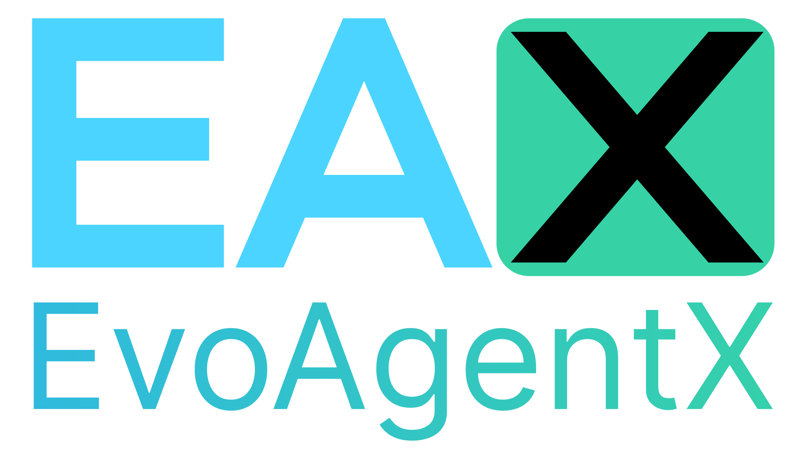
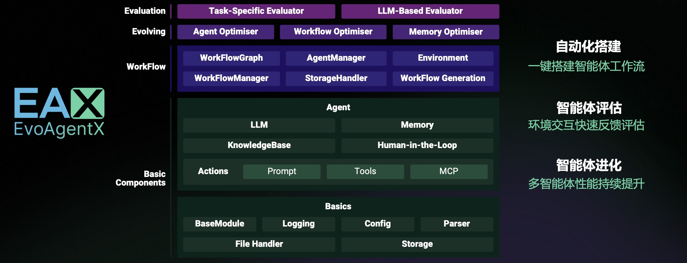
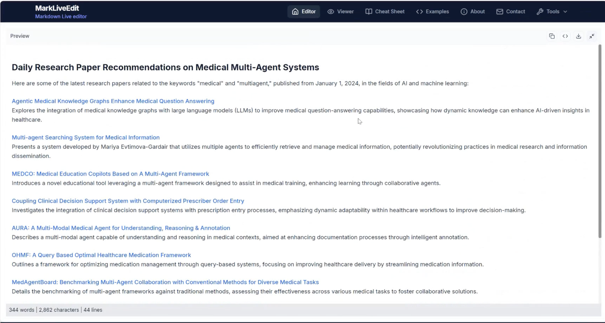
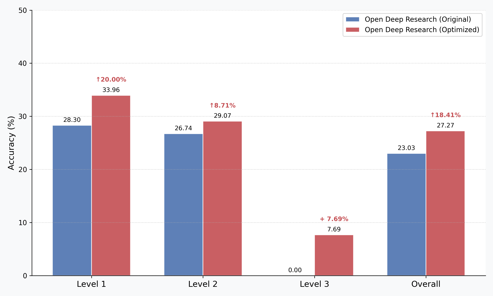
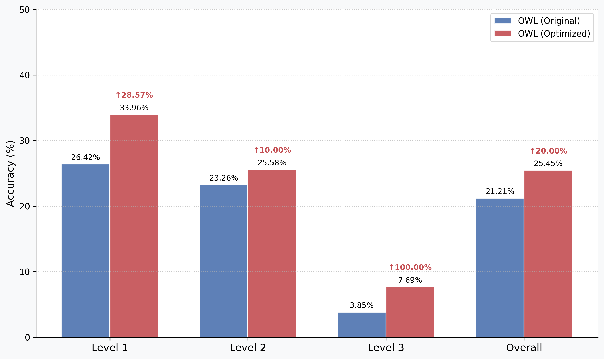

<!-- Add logo here -->
<div align="center">
  <a href="https://github.com/EvoAgentX/EvoAgentX">
    
  </a>
</div>

<h2 align="center">
    構建自我進化的 AI 智能體生態系統
</h2>

<div align="center">

[](https://evoagentx.org/)
[](https://EvoAgentX.github.io/EvoAgentX/)
[](https://discord.gg/XWBZUJFwKe)
[](https://x.com/EvoAgentX)
[](./assets/wechat_info.md)
[](https://star-history.com/#EvoAgentX/EvoAgentX)
[](https://github.com/EvoAgentX/EvoAgentX/fork)
[](https://github.com/EvoAgentX/EvoAgentX/blob/main/LICENSE)
<!-- [](https://EvoAgentX.github.io/EvoAgentX/) -->
<!-- [](https://huggingface.co/EvoAgentX) -->
</div>

<div align="center">

<h3 align="center">

<a href="./README.md">English</a> | <a href="./README-zh.md" style="text-decoration: underline;">簡體中文</a>

</h3>

</div>

<h4 align="center">
  <i>面向 Agent 工作流評估與進化的自動化框架</i>
</h4>

<p align="center">
  
</p>

## 什麼是 EvoAgentX  
EvoAgentX 是一個開源框架，用於**構建、評估和進化基於大型語言模型 (LLM) 的智能體或智能體工作流**，並以自動化、模組化和目標驅動的方式運行。  

其核心思想是讓開發者和研究人員突破靜態的提示鏈（prompt chaining）或人工工作流編排，轉而進入一個**自我進化的智能體生態**。在這個生態中，AI 智能體可以不斷學習、改進並自我優化以更好地完成既定目標。  

### ✨ 主要特性  

- 🧱 **智能體工作流自動構建**  
  只需一個簡單提示，EvoAgentX 就能生成結構化的多智能體工作流，並根據任務需求自動適配。  

- 🔍 **內建評估機制**  
  集成自動化評估器，可根據任務特定標準對智能體行為進行評分。  

- 🔁 **自我進化引擎**  
  智能體不僅能執行任務，還能學習。EvoAgentX 使用自我進化算法不斷改進工作流。  

- 🧩 **即插即用的模型相容性**  
  可輕鬆整合 [OpenAI](https://github.com/EvoAgentX/EvoAgentX/blob/main/evoagentx/models/openai_model.py)、[qwen](https://github.com/EvoAgentX/EvoAgentX/blob/main/evoagentx/models/aliyun_model.py) 等模型接口。  

- 🧰 **豐富的內建工具**  
  EvoAgentX 提供一整套內建工具，賦能智能體與真實世界環境互動。  

- 🧠 **記憶模組**  
  支援短期（暫時）與長期（持久）記憶系統，讓智能體具備「記憶力」。  

- 🧑‍💻 **人類在環 (HITL)**  
  支援互動式工作流，允許人類對智能體的行為進行審閱、修正與引導。  


### 🚀 你能用 EvoAgentX 做什麼  

EvoAgentX 不僅僅是一個框架，它是你打造**可在現實中使用的 AI 智能體的發射台**。  

無論你是 AI 研究者、工作流工程師，還是創業團隊，EvoAgentX 都能幫你**從一個初步的想法出發，快速構建成一個完整的智能體系統**——以最小的工程成本達成可用性。  

以下是一些場景：  

- 🔍 **難以優化工作流？**  
  EvoAgentX 可利用最先進的自我進化算法，**自動優化智能體工作流**，並根據你的資料集與目標不斷改進。  

- 🧑‍💻 **希望保持監督和控制？**  
  你可以隨時插入工作流！EvoAgentX 支援 **人機協同 (HITL)** 檢查點，讓你在需要時介入審查或引導流程，完成後再退出。  

- 🧠 **厭倦了健忘的智能體？**  
  EvoAgentX 內建 **短期與長期記憶模組**，讓智能體能夠記住、反思並在多輪互動中不斷提升。  

- ⚙️ **困在繁瑣的手動編排中？**  
  只需描述目標，EvoAgentX 會 **自動組裝多智能體工作流**，精準匹配你的意圖。  

- 🌍 **希望智能體真正「做事」？**  
  借助豐富的工具庫（搜尋、程式碼、瀏覽器、檔案 I/O、API 等），EvoAgentX 讓智能體能**與現實世界互動**，而不僅僅是生成對話。  


## 🔥 EAX 最新動態  

- **[2025年8月]** 🚀 **全新綜述發佈！**  
  我們團隊剛剛發佈了一篇關於 **自我進化 AI 智能體** 的綜合性綜述，深入探討了智能體如何學習、適應與持續優化。  
  👉 [在 arXiv 閱讀](https://arxiv.org/abs/2508.07407)  
  👉 [檢視倉庫](https://github.com/EvoAgentX/Awesome-Self-Evolving-Agents)  

- **[2025年7月]** 📚 **EvoAgentX 框架論文上線！**  
  我們已在 arXiv 正式發表了 EvoAgentX 框架論文，詳細介紹了構建自我進化智能體工作流的方法。  
  👉 [點此檢視](https://arxiv.org/abs/2507.03616)  

- **[2025年7月]** ⭐️ **突破 1,000 Star！**  
  感謝我們出色的社群支持，**EvoAgentX** 在 GitHub 上已突破 1,000 顆 Star！  

- **[2025年5月]** 🚀 **正式發佈！**  
  **EvoAgentX** 正式上線！從第一天起就能開始構建自我進化 AI 工作流。  
  🔧 [GitHub 快速上手](https://github.com/EvoAgentX/EvoAgentX)  

## ⚡ 快速開始
- [🔥 最新消息](#-最新消息)
- [⚡ 快速開始](#-快速開始)
- [安裝](#安裝)
- [LLM 設定](#llm設定)
  - [API 金鑰配置](#api金鑰配置)
  - [配置並使用 LLM](#配置並使用llm)
- [自動工作流生成](#自動工作流生成)
- [工具驅動的工作流生成](#工具驅動的工作流生成)
- [Human-in-the-Loop 支援](#human-in-the-loop支援)
- [示範影片](#示範影片)
  - [✨ 最終結果](#-最終結果)
- [進化演算法](#進化演算法)
  - [📊 結果](#-結果)
- [應用案例](#應用案例)
- [教學與使用案例](#教學與使用案例)
- [🗣️ EvoAgentX 講座](#evoagentx-talk)
- [🎯 路線圖](#-路線圖)
- [🙋 支援](#-支援)
  - [加入社群](#加入社群)
  - [將會議加入到您的行事曆](#將會議加入到您的行事曆)
  - [聯絡資訊](#聯絡資訊)
  - [觀看過往社群會議](#觀看過往社群會議)
- [🙌 為 EvoAgentX 貢獻](#-為evoagentx做貢獻)
- [📖 引用](#-引用)
- [📚 致謝](#-致謝)
- [📄 授權條款](#-授權條款)


## 安裝

我們推薦透過 `pip` 安裝 EvoAgentX：

```bash
pip install evoagentx
```

或者從原始碼安裝：

```bash
pip install git+https://github.com/EvoAgentX/EvoAgentX.git
```

對於本地開發或詳細設定（例如，使用 conda），請參考 [EvoAgentX 安裝指南](./docs/zh/installation.md)。

<details>
<summary>範例（可選，用於本地開發）：</summary>

```bash
git clone https://github.com/EvoAgentX/EvoAgentX.git
cd EvoAgentX
# 建立新的 conda 環境
conda create -n evoagentx python=3.11

# 啟用環境
conda activate evoagentx

# 安裝相依
pip install -r requirements.txt
# 或以開發模式安裝
pip install -e .
```
</details>

## LLM 設定

### API 金鑰配置 

要在 EvoAgentX 中使用 LLM（如 OpenAI），您必須設定 API 金鑰。

<details>
<summary>選項 1：透過環境變數設定 API 金鑰</summary> 

- Linux/macOS: 
```bash
export OPENAI_API_KEY=<your-openai-api-key>
```

- Windows 命令提示字元: 
```cmd 
set OPENAI_API_KEY=<your-openai-api-key>
```

- Windows PowerShell:
```powershell
$env:OPENAI_API_KEY="<your-openai-api-key>" #必要的
```

設定後，您可以在 Python 程式中存取金鑰：
```python
import os
OPENAI_API_KEY = os.getenv("OPENAI_API_KEY")
```
</details>

<details>
<summary>選項 2：使用 .env 檔案</summary> 

- 在專案根目錄建立 .env 檔並加入以下內容：
```bash
OPENAI_API_KEY=<your-openai-api-key>
```

然後在 Python 中載入：
```python
from dotenv import load_dotenv 
import os 

load_dotenv() # 從 .env 檔載入環境變數
OPENAI_API_KEY = os.getenv("OPENAI_API_KEY")
```
</details>
<!-- > 🔐 提示：不要忘記將`.env`加入到`.gitignore`以避免提交敏感資訊。 -->

### 配置並使用 LLM
設定好 API 金鑰後，使用以下方式初始化 LLM：

```python
from evoagentx.models import OpenAILLMConfig, OpenAILLM

# 從環境中載入 API 金鑰
OPENAI_API_KEY = os.getenv("OPENAI_API_KEY")

# 定義 LLM 配置
openai_config = OpenAILLMConfig(
    model="gpt-4o-mini",       # 指定模型名稱
    openai_key=OPENAI_API_KEY, # 直接傳遞金鑰
    stream=True,               # 啟用串流回應
    output_response=True       # 將回應列印到標準輸出
)

# 初始化語言模型
llm = OpenAILLM(config=openai_config)

# 從 LLM 生成回應
response = llm.generate(prompt="什麼是智能體工作流？")
```
> 📖 有關支援的模型與配置選項的更多細節：[LLM 模組指南](./docs/zh/modules/llm.md)。


## 自動工作流生成
配置好 API 金鑰與語言模型後，您可以在 EvoAgentX 中自動生成與執行多智能體工作流。

🧩 核心步驟：
1. 定義自然語言目標
2. 使用 `WorkFlowGenerator` 生成工作流
3. 使用 `AgentManager` 實例化智能體
4. 透過 `WorkFlow` 執行工作流

💡 最小範例：
```python
from evoagentx.workflow import WorkFlowGenerator, WorkFlowGraph, WorkFlow
from evoagentx.agents import AgentManager

goal = "生成可在瀏覽器中玩的 Tetris（俄羅斯方塊）HTML 遊戲程式碼"
workflow_graph = WorkFlowGenerator(llm=llm).generate_workflow(goal)

agent_manager = AgentManager()
agent_manager.add_agents_from_workflow(workflow_graph, llm_config=openai_config)

workflow = WorkFlow(graph=workflow_graph, agent_manager=agent_manager, llm=llm)
output = workflow.execute()
print(output)
```

您還可以：
- 📊 可視化工作流：`workflow_graph.display()`
- 💾 儲存/載入工作流：`save_module()` / `from_file()`

> 📂 完整的工作示例，請參考[`workflow_demo.py`](https://github.com/EvoAgentX/EvoAgentX/blob/main/examples/workflow_demo.py)


## 🧰 EvoAgentX 內建工具概覽  

EvoAgentX 提供了一整套功能完整的 **內建工具**，支援智能體與程式碼環境、搜尋引擎、資料庫、檔案系統、影像以及瀏覽器進行互動。  
這些模組化工具包構成了多智能體工作流的基礎，且易於擴充、定製與測試。  

工具類別包括：  
- 🧮 程式碼解釋器（Python、Docker）  
- 🔍 搜尋與 HTTP 請求（Google、Wikipedia、arXiv、RSS）  
- 🗂️ 檔案系統工具（讀/寫、shell 指令）  
- 🧠 資料庫（MongoDB、PostgreSQL、FAISS）  
- 🖼️ 影像工具（分析、生成）  
- 🌐 瀏覽器自動化（底層與由 LLM 驅動）  

我們非常歡迎社群貢獻！  
你可以透過 [Pull Requests](https://github.com/EvoAgentX/EvoAgentX/pulls) 或 [Discussions](https://github.com/EvoAgentX/EvoAgentX/discussions) 提出或提交新的工具。  

<details>
<summary>點擊展開完整工具表 🔽</summary>

<br>
  
| 工具包名稱 | 描述 | 程式碼檔案路徑 | 測試檔案路徑 |
|------------|------|--------------|--------------|
| **🧰 程式碼解釋器** |  |  |  |
| PythonInterpreterToolkit | 安全執行 Python 程式片段或本地 .py 腳本，支援沙箱匯入與受控檔案系統存取。 | [link](evoagentx/tools/interpreter_python.py) | [link](examples/t[...]
| DockerInterpreterToolkit | 在隔離的 Docker 容器中執行程式碼（例如 Python）——適用於不受信任程式碼、特殊相依或嚴格隔離場景。 | [link](evoagentx/tools/interpreter_dock[...]
| **🧰 搜尋與請求工具** |  |  |  |
| WikipediaSearchToolkit | 搜尋維基百科並回傳結果（標題、摘要、完整內容與連結）。 | [link](evoagentx/tools/search_wiki.py) | [link](examples/tools/tools_search.py) |
| GoogleSearchToolkit | Google 自訂搜尋（官方 API）。需要 GOOGLE_API_KEY 與 GOOGLE_SEARCH_ENGINE_ID。 | [link](evoagentx/tools/search_google.py) | [link](examples/tools/tools_search.py)[...]
| GoogleFreeSearchToolkit | 無需 API 憑證的 Google 風格搜尋（輕量替代方案）。 | [link](evoagentx/tools/search_google_f.py) | [link](examples/tools/tools_search.py) |
| DDGSSearchToolkit | 使用 DDGS 進行搜尋，支援多種後端，結果更注重隱私。 | [link](evoagentx/tools/search_ddgs.py) | [link](examples/tools/tools_search.py) |
| SerpAPIToolkit | 透過 SerpAPI 提供多引擎搜尋（Google/Bing/Baidu/Yahoo/DDG），支援內容擷取。需要 SERPAPI_KEY。 | [link](evoagentx/tools/search_serpapi.py) | [link](examples/tool[...]
| SerperAPIToolkit | 使用 SerperAPI 進行 Google 搜尋並擷取內容。需要 SERPERAPI_KEY。 | [link](evoagentx/tools/search_serperapi.py) | [link](examples/tools/tools_search.py) |
| RequestToolkit | 通用 HTTP 用戶端（GET/POST/PUT/DELETE），支援參數、表單、JSON、Headers、原始/處理回應，可選存檔。 | [link](evoagentx/tools/request.py) | [link[...]
| ArxivToolkit | 擷取 arXiv 研究論文（標題、作者、摘要、連結/分類）。 | [link](evoagentx/tools/request_arxiv.py) | [link](examples/tools/tools_search.py) |
| RSSToolkit | 爬取 RSS 源（可選網頁內容擷取）並驗證 feed。 | [link](evoagentx/tools/rss_feed.py) | [link](examples/tools/tools_search.py) |
| GoogleMapsToolkit | 基於 Google API 的地理資訊檢索與路徑規劃。 | [link](evoagentx/tools/google_maps_tool.py) | [link](examples/tools/google_maps_example.py) |
| **🧰 檔案系統工具** |  |  |  |
| StorageToolkit | 檔案 I/O 工具：儲存/讀取/附加/刪除，檢查是否存在，列出檔案，支援可插拔儲存後端。 | [link](evoagentx/tools/storage_file.py) | [link](examples/tool[...]
| CMDToolkit | 執行 Shell/CLI 指令，支援工作目錄與逾時控制；回傳 stdout/stderr/返回碼。 | [link](evoagentx/tools/cmd_toolkit.py) | [link](examples/tools/tools_files.py) |
| FileToolkit | 檔案操作工具包，用於管理檔案與目錄。 | [link](evoagentx/tools/file_tool.py) | [link](examples/tools/tools_files.py) |
| **🧰 資料庫工具** |  |  |  |
| MongoDBToolkit | MongoDB 操作——執行查詢/聚合，支援過濾/投影/排序的查找、更新、刪除與資訊擷取。 | [link](evoagentx/tools/database_mongodb.py) | [link](examples/too[...]
| PostgreSQLToolkit | PostgreSQL 操作——支援通用 SQL 執行、定向 SELECT、UPDATE、CREATE、DELETE 與資訊擷取。 | [link](evoagentx/tools/database_postgresql.py) | [link](examples/to[...]
| FaissToolkit | 向量資料庫（FAISS）語意檢索——插入文件（自動切分+嵌入）、相似度查詢、按 ID/元資料刪除、統計。 | [link](evoagentx/tools/database_faiss.py) | [...]
| **🧰 影像處理工具** |  |  |  |
| ImageAnalysisToolkit | 視覺分析（基於 OpenRouter GPT-4o 系列）：描述影像、擷取物件/介面資訊、回答影像相關問題。 | [link](evoagentx/tools/OpenAI_Image_Generation.py)[...]
| OpenAIImageGenerationToolkit | 文生圖工具（OpenAI DALL·E 系列），支援尺寸/品質/風格控制。 | [link](evoagentx/tools/OpenAI_Image_Generation.py) | [link](examples/tools/tools_ima[...]
| FluxImageGenerationToolkit | 文生圖工具（Flux Kontext Max, BFL），支援寬高比、種子、格式、提示詞增強與安全容忍度。 | [link](evoagentx/tools/flux_image_generation.py) [...]
| **🧰 瀏覽器工具** |  |  |  |
| BrowserToolkit | 細粒度瀏覽器自動化：初始化、導向、輸入、點擊、頁面快照、讀取控制台日誌、關閉瀏覽器。 | [link](evoagentx/tools/browser_tool.py) | [link](exa[...]
| BrowserUseToolkit | 高層級自然語言驅動的瀏覽器自動化：導向、填表、點擊、搜尋等，由 LLM 控制。 | [link](evoagentx/tools/browser_use.py) | [link](examples/tools/tools[...]

</details>  

**EvoAgentX 同樣支援 MCP 工具。**  
請參考我們的 [教學](https://github.com/EvoAgentX/EvoAgentX/blob/main/docs/tutorial/mcp.md)，了解如何在 EvoAgentX 中配置你偏好的 MCP 工具。  

## 工具驅動的工作流生成

在更高階的場景中，您的工作流 Agent 可能需要使用外部工具。EvoAgentX 支援自動工具整合：您可以將工具列表傳遞給 WorkFlowGenerator，生成器會根據需要將相關工具分配到工作流中的智能體。[...]

例如，啟用 `ArxivToolkit`：

```python
from evoagentx.tools import ArxivToolkit

# 初始化工具包
arxiv_toolkit = ArxivToolkit()

# 讓生成器在生成工作流時考慮該工具
wf_generator = WorkFlowGenerator(llm=llm, tools=[arxiv_toolkit])
workflow_graph = wf_generator.generate_workflow(goal="Find and summarize the latest research on AI in the field of finance on arXiv")

# 為相關 Agent 賦予該工具的使用權限
agent_manager = AgentManager(tools=[arxiv_toolkit])
agent_manager.add_agents_from_workflow(workflow_graph, llm_config=openai_config)

workflow = WorkFlow(graph=workflow_graph, agent_manager=agent_manager, llm=llm)
output = workflow.execute()
print(output)
```

在此設定下，工作流生成器可能會將 `ArxivToolkit` 分配給相關 Agent，使其在工作流中按需呼叫該工具。


## Human-in-the-Loop 支援

在一些需要嚴格把控的場景中，EvoAgentX 支援將人機協同（Human-in-the-Loop，HITL）整合到 Agent 工作流中。這意味著在關鍵步驟執行前可暫停，等待人工審批或輸入，以降低風險並提高結果可信度。[...]

所有人工互動由集中式的 `HITLManager` 管理。HITL 模組包括專用代理，例如：

- HITLInterceptorAgent：攔截並審批關鍵操作
- HITLUserInputCollectorAgent：收集使用者輸入

示例：在發送郵件前要求人工批准

```python
from evoagentx.hitl import HITLManager, HITLInterceptorAgent, HITLInteractionType, HITLMode

hitl_manager = HITLManager()
hitl_manager.activate()  # 啟用 HITL（預設關閉）

# 建立攔截代理，攔截 DataSendingAgent 的 DummyEmailSendAction
interceptor = HITLInterceptorAgent(
    target_agent_name="DataSendingAgent",
    target_action_name="DummyEmailSendAction",
    interaction_type=HITLInteractionType.APPROVE_REJECT,
    mode=HITLMode.PRE_EXECUTION  # 在執行前詢問
)

# 將人工確認結果映射回工作流輸入，保證資料流連續
hitl_manager.hitl_input_output_mapping = {"human_verified_data": "extracted_data"}

# 將攔截代理加入 AgentManager，並在工作流中啟用 HITL
agent_manager.add_agent(interceptor)
workflow = WorkFlow(graph=workflow_graph, agent_manager=agent_manager, llm=llm, hitl_manager=hitl_manager)
```

當此攔截器觸發時，工作流會暫停並在主控台提示輸入 `[a]pprove` 或 `[r]eject`。批准：流程繼續執行，並使用經過人工確認的資料；拒絕：跳過該操作或採取替代流程。[...]

📂 完整範例可參考 [tutorial/hitl.md](https://github.com/EvoAgentX/EvoAgentX/blob/615b06d29264f47e58a6780bd24f0e73cbf7deee/docs/tutorial/hitl.md)


## 示範影片


[](https://www.youtube.com/watch?v=8ALcspHOe0o)
[](https://www.bilibili.com/video/BV1AjahzRECi/?vd_source=02f8f3a7c8865b3af6378d968039[...]

<div align="center">
  <video src="https://github.com/user-attachments/assets/65af8cce-43ad-4e81-ab8d-fc085a7fdc05.mp4" autoplay loop muted playsinline width="600">
    您的瀏覽器不支援此影片標籤。
  </video>
</div>

在本示範中，我們將透過兩個範例展示 EvoAgentX 的工作流生成與執行能力：  

- **應用場景 1：金融資訊智能體工作流**  

  在該範例中，我們使用 EvoAgentX 自動生成的工作流，根據給定指數收集某家公司公開資訊。收集的資料包括整體市場指數、公司當前股價、機構買賣動向等。[...]
  最終，該工作流會產生一份 **HTML 報告**，對資訊進行整理並提供買入／賣出／持有的建議。需要注意的是，這個工作流目前僅為 alpha 版本。 
  
  如果你希望將它變成一個**真正實用的投資助手**，可以嘗試整合更多金融指標與分析工具——並讓這些工具通過智能體加入到你的工作流中！  
  👉 [點此體驗該工作流](https://github.com/EvoAgentX/EvoAgentX/blob/main/examples/workflow/invest/stock_analysis.py)  

- **應用場景 2：ArXiv 研究論文摘要工作流**  

  該工作流由 EvoAgentX 自動生成，並由 ArXiv MCP 工具驅動。它能根據你提供的關鍵詞與時間範圍，從 arXiv 擷取並摘要相關論文。
  
  如果你有興趣，還可以**將此工作流擴充到 arXiv 之外**，與 **Google Scholar** 等其他學術搜尋平台整合，從而打造一個功能完整的研究助手應用！  
  👉 [點此嘗試該工作流](https://github.com/EvoAgentX/EvoAgentX/blob/main/examples/workflow/arxiv_workflow.py)  

### ✨ 最終結果

<table>
  <tr>
    <td align="center">
      <br>
      <strong>Application&nbsp;1:</strong><br>金融資訊智能體工作流
    </td>
    <td align="center">
      <br>
      <strong>Application&nbsp;2:</strong><br>ArXiv 研究論文摘要工作流
    </td>
  </tr>
</table>

## 進化演算法  

我們在 EvoAgentX 中整合了一些高效的智能體／工作流進化演算法：  

| **演算法** | **描述** | **連結** |
|----------|----------|----------|
| **TextGrad**  | 基於梯度的最佳化方法，用於改進 LLM 提示與推理鏈，實現可微分的規劃。 | [📄 Nature (2025)](https://www.nature.com/articles/s41586-025-08661-4) |
| **MIPRO**     | 與模型無關的迭代提示最佳化方法，利用黑箱評估與自適應重排序。 | [📄 arXiv:2406.11695](https://arxiv.org/abs/2406.11695) |
| **AFlow**     | 借鑑強化學習的智能體工作流進化方法，使用蒙特卡洛樹搜尋。 | [📄 arXiv:2410.10762](https://arxiv.org/abs/2410.10762) |

**歡迎透過提交 issue 或 Pull Request 來推薦最新的自我進化演算法。**  

為了評估效能，我們使用這些演算法在三個不同任務上最佳化相同的智能體系統：多跳問答（HotPotQA）、程式碼生成（MBPP）以及推理（MATH）。  
我們隨機抽取 50 個樣本作為驗證集，另取 100 個樣本作為測試集。  

> 提示：我們已在 EvoAgentX 中整合了這些基準測試與評估程式碼。詳情請參考 [基準測試與評估教學](https://github.com/EvoAgentX/EvoAgentX/blob/main/docs/tutorial/benchmark[...]

### 📊 結果 

| 方法     | HotPotQA<br>(F1%) | MBPP<br>(Pass@1 %) | MATH<br>(解題率 %) |
|----------|--------------------|---------------------|--------------------------|
| 原始     | 63.58              | 69.00               | 66.00                    |
| TextGrad | 71.02              | 71.00               | 76.00                    |
| AFlow    | 65.09              | 79.00               | 71.00                    |
| MIPRO    | 69.16              | 68.00               | 72.30       

更多詳情請參考 `examples/optimization` 資料夾。

## 應用案例 

我們使用框架在 [GAIA](https://huggingface.co/spaces/gaia-benchmark/leaderboard) 基準中優化現有的多智能體系統。選取來自 GAIA 排行榜的兩個代表性系統並進行實驗。[...]

我們應用 EvoAgentX 來優化它們的提示詞。下圖顯示了優化後智能體在 GAIA 基準驗證集上的效能提升。

<table>
  <tr>
    <td align="center" width="50%">
      <br>
      <strong>Open Deep Research</strong>
    </td>
    <td align="center" width="50%">
      <br>
      <strong>OWL 智能體</strong>
    </td>
  </tr>
</table>

> 完整優化報告：[Open Deep Research](https://github.com/eax6/smolagents) 和 [OWL](https://github.com/TedSIWEILIU/owl)。  

## 教學與使用案例

> 💡 **EvoAgentX 新手？** 從[快速入門指南](./docs/zh/quickstart.md)開始，逐步了解基本使用方法。


透過以下資源了解如何有效使用 EvoAgentX：

| 指南 | 描述 |
|:---|:---|
| **[建立您的第一個智能體](./docs/zh/tutorial/first_agent.md)** | 快速建立與管理具備多動作能力的智能體。 |
| **[建立您的第一個工作流](./docs/zh/tutorial/first_workflow.md)** | 學習如何使用多個智能體構建協作工作流。 |
| **[使用工具](./docs/zh/tutorial/tools.md)** | 掌握 EvoAgentX 強大的工具生態系，實現智能體互動。 |
| **[自動工作流生成](./docs/zh/quickstart.md#automatic-workflow-generation-and-execution)** | 從自然語言目標自動生成工作流。 |
| **[基準測試與評估教學](./docs/zh/tutorial/benchmark_and_evaluation.md)** | 使用基準資料集評估智能體效能。 |
| **[TextGrad 優化器教學](./docs/zh/tutorial/textgrad_optimizer.md)** | 使用 TextGrad 自動優化多智能體工作流中的提示詞。 |
| **[AFlow 優化器教學](./docs/zh/tutorial/aflow_optimizer.md)** | 使用 AFlow 自動優化多智能體工作流的提示詞與結構。 |
| **[Human-In-The-Loop 教學](./docs/tutorial/hitl.md)** | 在您的 WorkFlow 中啟用 HITL 功能。 |
<!-- | **[SEW 優化器教學](./docs/zh/tutorial/sew_optimizer.md)** | 建立 SEW（自我進化工作流）來增強智能體系統。 | -->

🛠️ 透過這些教學建立並優化您的 EvoAgentX 工作流。

🚀 我們正在積極擴充用例庫與優化策略。**更多內容即將推出—敬請期待！**

## 🗣️ EvoAgentX TALK
EvoAgentX 定期邀請頂尖研究者舉辦講座，分享 AI 領域的前沿主題。  
以下是已安排與完成的講座記錄：

| 發言者 | 主題 | 日期 | 會議影片 |
|---|---|---|---|
| [張曦](https://x-izhang.github.io/) | [EvoAgentX 講座] EvoScientist | 2026-04-05 |  [YouTube](https://www.youtube.com/watch?v=EVrxBC99_1k&t=2745s)  |
| [董冠霖](https://dongguanting.github.io/) | [EvoAgentX 講座] 基於智能體的強化策略優化 | 2025-10-30 |  [YouTube](https://www.youtube.com/watch?v=UB-FL5JFXJY)  |
| [張桂彬](https://www.guibinz.top/) | [EvoAgentX 講座] 智能體強化學習如何將大模型轉化為自動化智能體 | 2025-09-28 | [YouTube](https://www.youtube.com/watch?v=xzqZsZWfabw&t=3s) |
| [EvoAgentX 團隊](https://github.com/EvoAgentX/EvoAgentX) | [EvoAgentX 演示] 自進化智能體實戰：股票分析助手與 arXiv 論文推薦系統 | 2025-09-04 | [YouTube](https://www.youtube.com/watch?v=8ALcspHOe0o&t=33s) |
| [EvoAgentX 團隊](https://github.com/EvoAgentX/EvoAgentX) | [EvoAgentX 會議] EvoAgentX 開源會議：2025-08-17 | 2025-08-17 | [YouTube](https://www.youtube.com/watch?v=Xy4sObew-a0&t=9s) |
| [張恆哲](https://hengzhe-zhang.github.io/) | [EvoAgentX 講座] 遺傳編程：從進化算法到大模型時代 | 2025-08-10 | [YouTube](https://www.youtube.com/watch?v=naja_kDYc_Y) |
| [EvoAgentX 團隊](https://github.com/EvoAgentX/EvoAgentX) | [EvoAgentX 會議] EvoAgentX 開源會議：2025-07-27 | 2025-07-27 | [YouTube](https://www.youtube.com/watch?v=dgJFCrbllWI) |
| [EvoAgentX 團隊](https://github.com/EvoAgentX/EvoAgentX) | [EvoAgentX 會議] EvoAgentX 開源會議：2025-07-20 | 2025-07-20 | [YouTube](https://www.youtube.com/watch?v=mnJYmdgo8HA&t=68s) |
| [EvoAgentX 團隊](https://github.com/EvoAgentX/EvoAgentX) | [EvoAgentX 會議] EvoAgentX 開源會議：2025-07-06 | 2025-07-06 | [YouTube](https://www.youtube.com/watch?v=AIAl6rB4fC0) |
| [EvoAgentX 團隊](https://github.com/EvoAgentX/EvoAgentX) | [EvoAgentX 會議] EvoAgentX 開源會議：2025-06-22 | 2025-06-22 | [YouTube](https://www.youtube.com/watch?v=3y0Ppq3BN1A&t=1401s) |
| [EvoAgentX 團隊](https://github.com/EvoAgentX/EvoAgentX) | [EvoAgentX 會議] EvoAgentX 首次社區會議：探索自進化 AI 智能體的未來！ | 2025-06-10 | [YouTube](https://www.youtube.com/watch?v=WzWo9aYPHMs&t=414s) |
| [EvoAgentX 團隊](https://github.com/EvoAgentX/EvoAgentX) | [EvoAgentX 演示] EvoAgentX 工作流生成演示 | 2025-05-14 | [YouTube](https://www.youtube.com/watch?v=Wu0ZydYDqgg) |


## 🎯 路線圖
- [ ] **模組化進化演算法**：將最佳化演算法抽象為即插即用的模組，便於整合到自訂工作流中。 
- [ ] **開發任務模板與智能體模組**：構建典型任務的可重用模板和標準化智能體組件，以簡化應用開發。
- [ ] **整合自我進化智能體演算法**：整合更多最新與先進的智能體自我進化技術，跨多個維度，包括提示詞調整、工作流結構和記憶模組。 
- [ ] **啟用可視化工作流編輯介面**：提供工作流結構顯示與編輯的可視化介面，以提高可用性與除錯能力。 


## 🙋 支援

### 加入社群

📢 保持聯繫，成為**EvoAgentX**旅程的一部分！  
🚩 加入我們的社群獲取最新更新，分享您的想法，並與全球 AI 愛好者協作。

- [Discord](https://discord.gg/XWBZUJFwKe) — 即時聊天、討論與協作。
- [X（前 Twitter）](https://x.com/EvoAgentX) — 關注我們以獲取新聞、更新與見解。
- [微信](https://github.com/EvoAgentX/EvoAgentX/blob/main/assets/wechat_info.md) — 連接我們的中文社群。

### 將會議加入到您的行事曆

📅 點擊下面的連結將 EvoAgentX 週會（週日，16:30-17:30 GMT+8）加入到您的行事曆：

👉 [加入到您的 Google 日曆](https://calendar.google.com/calendar/u/0/r/eventedit?text=EvoAgentX+周會（腾讯会议）&dates=20250629T083000Z/20250629T093000Z&details=會議連結：https://m[...]

👉 [加入到您的騰訊會議](https://meeting.tencent.com/dm/5UuNxo7Detz0)

👉 [下載 EvoAgentX_Weekly_Meeting.ics 檔案](./EvoAgentX_Weekly_Meeting.ics)

### 聯絡資訊

如果您對本專案有任何問題或回饋，請隨時聯絡我們。我們非常感謝您的建議！

- **電子郵件：** evoagentx.ai@gmail.com

我們會在 2-3 個工作日內回覆所有詢問。

### 觀看過往社群會議
- [Bilibili](https://space.bilibili.com/3493105294641286/favlist?fid=3584589186&ftype=create&spm_id_from=333.788.0.0)
- [YouTube](https://studio.youtube.com/playlist/PL_kuPS05qA1hyU6cLX--bJ93Km2-md8AA/edit)
## 🙌 為 EvoAgentX 做貢獻
感謝這些傑出的貢獻者

<a href="https://github.com/EvoAgentX/EvoAgentX/graphs/contributors">
  
</a>

我們感謝您對我們開源計畫的貢獻興趣。我們提供了[貢獻指南](https://github.com/EvoAgentX/EvoAgentX/blob/main/CONTRIBUTING.md)文件，其中概述了為 EvoAgentX 做貢獻的步驟與流程。[...]

[](https://www.star-history.com/#EvoAgentX/EvoAgentX&Date)


## 📖 引用

如果您覺得 EvoAgentX 有幫助，請考慮引用我們的工作：

📄 [EvoAgentX](https://arxiv.org/abs/2507.03616)
📄 [Survey Paper](https://arxiv.org/abs/2508.07407)

```bibtex
@article{wang2025evoagentx,
  title={EvoAgentX: An Automated Framework for Evolving Agentic Workflows},
  author={Wang, Yingxu and Liu, Siwei and Fang, Jinyuan and Meng, Zaiqiao},
  journal={arXiv preprint arXiv:2507.03616},
  year={2025}
}
@article{fang202survey,
      title={A Comprehensive Survey of Self-Evolving AI Agents: A New Paradigm Bridging Foundation Models and Lifelong Agentic Systems}, 
      author={Jinyuan Fang and Yanwen Peng and Xi Zhang and Yingxu Wang and Xinhao Yi and Guibin Zhang and Yi Xu and Bin Wu and Siwei Liu and Zihao Li and Zhaochun Ren and Nikos Aletras and Xi Wang an[...]
      year={2025},
      journal={arXiv preprint arXiv:2508.07407},
      url={https://arxiv.org/abs/2508.07407}, 
}
```


## 📚 致謝 
本專案基於幾個傑出的開源專案：[AFlow](https://github.com/FoundationAgents/MetaGPT/tree/main/metagpt/ext/aflow)、[TextGrad](https://github.com/zou-group/textgrad)、[DSPy](https://githu[...]

## 📄 授權條款

本倉庫中的原始程式碼依據 [MIT 許可](./LICENSE) 提供。

