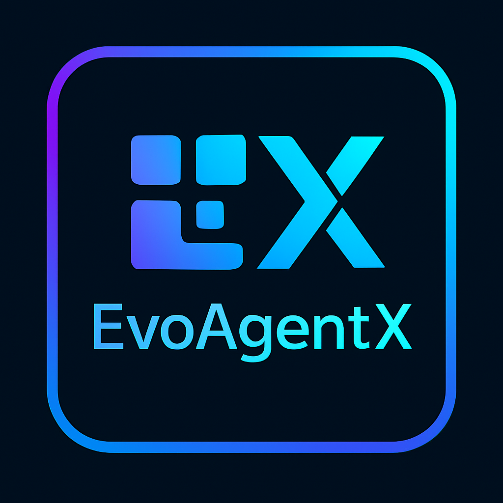

<!-- Add logo here -->
<div align="center">
  <a href="https://github.com/EvoAgentX/EvoAgentX">
    
  </a>
</div>

<h1 align="center">
    EvoAgentX:  构建自进化的 AI 智能体生态系统
</h1>

<div align="center">

[](https://EvoAgentX.github.io/EvoAgentX/)
[](https://discord.gg/EvoAgentX)
[](https://x.com/EvoAgentX)
[]()
[](https://huggingface.co/EvoAgentX)
[](https://star-history.com/#EvoAgentX/EvoAgentX)
[](https://github.com/EvoAgentX/EvoAgentX/blob/main/LICENSE)

</div>

<div align="center">

<h3 align="center">

[English](./README.md) | [简体中文](./README-zh.md) 

</h3>

</div>

<hr>

## 🔥 最新动态
- **[2025年5月]** 🎉 **EvoAgentX** 正式发布！

## ⚡开始使用
- [安装指南](#installation)
- [配置指南](#configuration)
- [示例：自动工作流生成](#examples-automatic-workflow-generation)
- [快速开始 & 演示视频](#quickstart--demo-video)
- [教程和使用案例](#tutorial-and-use-cases)

### 安装

请参阅 [EvoAgentX 安装指南](./docs/installation.md) 以获取详细的安装步骤。

创建环境：
1. 克隆此代码库并进入 EvoAgentX 文件夹
```bash
git clone https://github.com/EvoAgentX/EvoAgentX.git
cd EvoAgentX
```

2. 安装依赖包
```Shell
conda create -n evoagentx python=3.10 
conda activate evoagentx
pip install -r requirements.txt 
```


### 示例：自动工作流生成
```python
from evoagentx.models import OpenAILLMConfig, OpenAILLM
from evoagentx.agents import AgentManager
from evoagentx.workflow import WorkFlowGenerator, WorkFlowGraph, WorkFlow

OPENAI_API_KEY = "OPENAI_API_KEY" 
# set output_response=True to see LLM outputs 
openai_config = OpenAILLMConfig(model="gpt-4o-mini", openai_key=OPENAI_API_KEY, stream=True, output_response=False)
model = OpenAILLM(config=openai_config)

agent_manager = AgentManager()
wf_generator = WorkFlowGenerator(llm=model)

# 生成工作流和智能体
workflow_graph: WorkFlowGraph = wf_generator.generate_workflow(goal="生成一个贪吃蛇游戏的python代码")

# [可选] 显示工作流
workflow_graph.display()
# [可选] 保存工作流 
workflow_graph.save_module("debug/workflow_demo.json")
#[可选] 加载已保存的工作流 
workflow_graph: WorkFlowGraph = WorkFlowGraph.from_file("debug/workflow_demo.json")

agent_manager.add_agents_from_workflow(workflow_graph)
# 执行工作流
workflow = WorkFlow(graph=workflow_graph, agent_manager=agent_manager, llm=model)
output = workflow.execute()
print(output)
```

### 快速开始 & 演示视频
Todos

请参阅[快速开始指南](./docs/quickstart.md) 以获得一步步的指导，帮助你快速上手 EvoAgentX。


### 教程和使用案例

探索如何有效地使用 EvoAgentX:

| Cookbook | Description |
|:---|:---|
| **[构建你的第一个智能体](./docs/tutorial/first_agent.md)** | 逐步创建第一个智能体的完全指南. |
| **[手动构建工作流](./docs/tutorial/first_workflow.md)** | 学习如何设计和实现写作智能体工作流. |
| **[基准和评估教程](./docs/tutorial/benchmark_and_evaluation.md)** | 智能体性能评估和准则测试指南. |
| **[SEW优化器教程](./docs/tutorial/sew_optimizer.md)** | 学习优化技术，提升智能体工作效率. |

🛠️ 按照教程构建和优化你的 EvoAgentX 工作流。

💡 通过这些实际案例，发掘 EvoAgentX 在你的项目中的潜力！

## 🙋 支持

### 加入社区

📢 参与并跟随  **EvoAgentX** 的发展历程！
🚩 加入我们的社区，获取最新动态，分享你的想法，并与全球的AI爱好者合作。

- [Discord](https://discord.com/invite/EvoAgentX) — 实时聊天，讨论和协作。
- [X (formerly Twitter)](https://x.com/EvoAgentX) — 获取新闻、更新和洞察。
- [WeChat]() — 与中国社区连接。

### 联系信息

如果你有任何问题或反馈，请随时联系我们。我们非常欢迎您的建议！

- **邮箱:** evoagentx.ai@gmail.com

我们将在2-3个工作日内回复所有问题。

## 🙌 为EvoAgentX做贡献
感谢以下优秀的贡献者

<a href="https://github.com/EvoAgentX/EvoAgentX/graphs/contributors">
  
</a>

我们感谢你对我们开源项目的兴趣。我们提供了 [贡献指南文档](https://github.com/clayxai/EvoAgentX/blob/main/CONTRIBUTING.md) 其中列出了为EvoAgentX做贡献的步骤。请参考此指南，确保顺利合作并取得成功。 🤝🚀

[](https://www.star-history.com/#EvoAgentX/EvoAgentX&Date)


## 📄 许可证
本仓库中的源代码根据 [MIT 许可证](./LICENSE) 提供。
