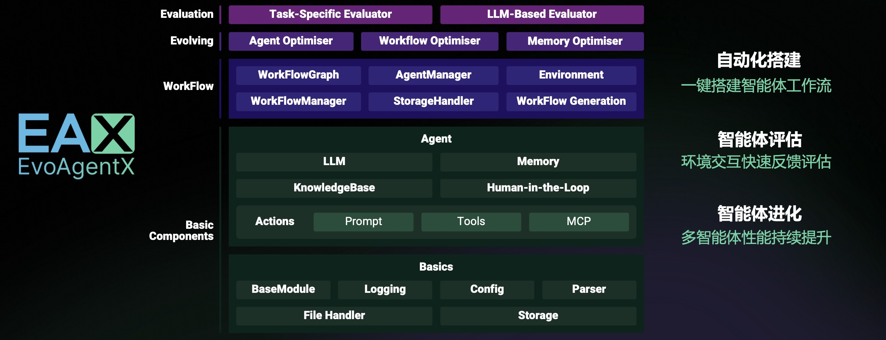
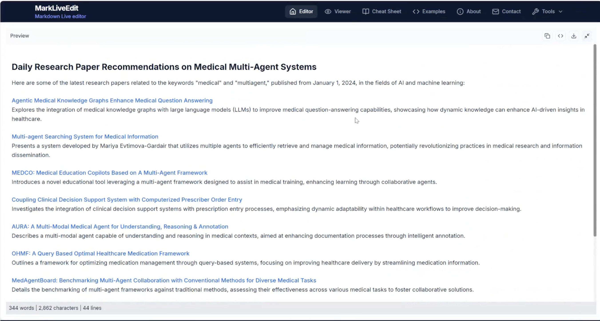
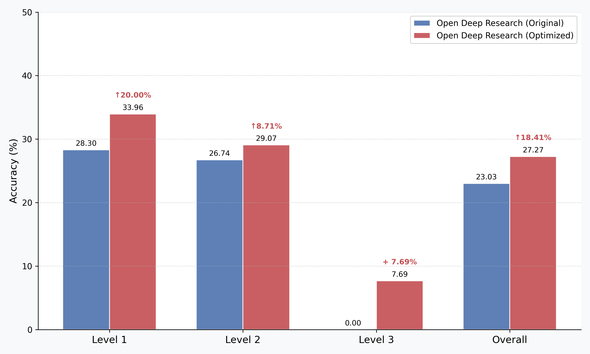
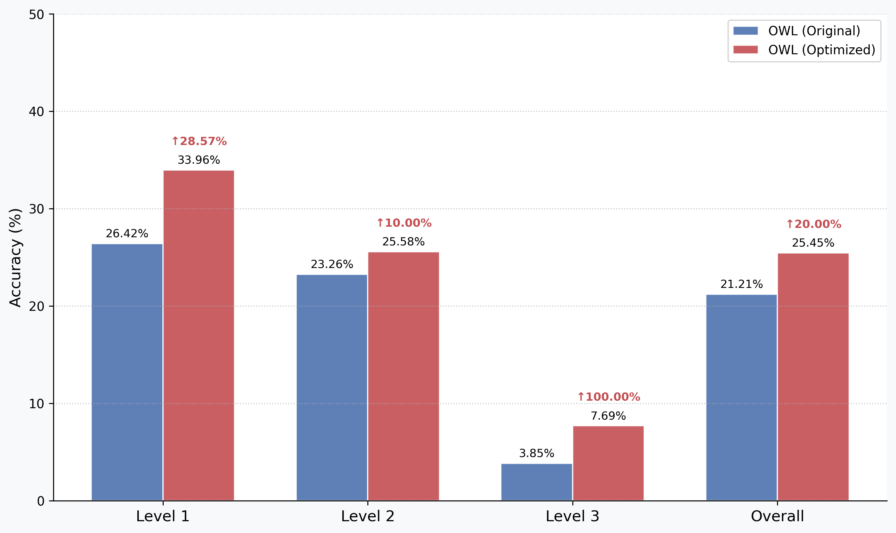

<!-- Add logo here -->
<div align="center">
  <a href="https://github.com/EvoAgentX/EvoAgentX">
    
  </a>
</div>

<h2 align="center">
    构建自进化的 AI 智能体生态系统
</h2>

<div align="center">

[](https://evoagentx.org/)
[](https://EvoAgentX.github.io/EvoAgentX/)
[](https://discord.gg/XWBZUJFwKe)
[](https://x.com/EvoAgentX)
[](./assets/wechat_info.md)
[](https://star-history.com/#EvoAgentX/EvoAgentX)
[](https://github.com/EvoAgentX/EvoAgentX/fork)
[](https://github.com/EvoAgentX/EvoAgentX/blob/main/LICENSE)
<!-- [](https://EvoAgentX.github.io/EvoAgentX/) -->
<!-- [](https://huggingface.co/EvoAgentX) -->
</div>

<div align="center">

<h3 align="center">

<a href="./README.md">English</a> | <a href="./README-zh.md" style="text-decoration: underline;">简体中文</a>

</h3>

</div>

<h4 align="center">
  <i>面向 Agent 工作流评估与演化的自动化框架</i>
</h4>

<p align="center">
  
</p>

## 什么是 EvoAgentX  
EvoAgentX 是一个开源框架，用于**构建、评估和进化基于大语言模型 (LLM) 的智能体或智能体工作流**，并以自动化、模块化和目标驱动的方式运行。  

其核心思想是让开发者和研究人员突破静态的提示链（prompt chaining）或人工工作流编排，转而进入一个**自我进化的智能体生态**。在这个生态中，AI 智能体能够被构建、评测，并通过迭代反馈循环不断优化——就像软件需要持续测试和改进一样。  

### ✨ 关键特性  

- 🧱 **智能体工作流自动构建**  
  只需一个简单提示，EvoAgentX 就能生成结构化的多智能体工作流，并根据任务需求自动适配。  

- 🔍 **内置评估机制**  
  集成自动化评估器，可根据任务特定标准对智能体行为进行评分。  

- 🔁 **自我进化引擎**  
  智能体不仅能执行任务，还能学习。EvoAgentX 使用自进化算法不断改进工作流。  

- 🧩 **即插即用的模型兼容性**  
  可轻松集成 [OpenAI](https://github.com/EvoAgentX/EvoAgentX/blob/main/evoagentx/models/openai_model.py)、[qwen](https://github.com/EvoAgentX/EvoAgentX/blob/main/evoagentx/models/aliyun_model.py) 等主流模型，也可通过 [LiteLLM](https://github.com/EvoAgentX/EvoAgentX/blob/main/evoagentx/models/litellm_model.py)、[siliconflow](https://github.com/EvoAgentX/EvoAgentX/blob/main/evoagentx/models/siliconflow_model.py)、[openrouter](https://github.com/EvoAgentX/EvoAgentX/blob/main/evoagentx/models/openrouter_model.py) 接入 Claude、Deepseek、kimi 等热门模型。若希望在本地部署 LLM，可尝试使用 LiteLLM。  

- 🧰 **丰富的内置工具**  
  EvoAgentX 提供一整套内置工具，赋能智能体与真实世界环境交互。  

- 🧠 **记忆模块**  
  支持短期（临时）与长期（持久）记忆系统，让智能体具备“记忆力”。  

- 🧑‍💻 **人类在环 (HITL)**  
  支持交互式工作流，允许人类对智能体的行为进行审阅、修正和引导。  


### 🚀 你能用 EvoAgentX 做什么  

EvoAgentX 不仅仅是一个框架，它是你打造**现实可用 AI 智能体的发射台**。  

无论你是 AI 研究者、工作流工程师，还是创业团队，EvoAgentX 都能帮你**从一个初步的想法出发，快速构建成一个完整的智能体系统**——以最小的工程成本实现最大的灵活性。  

以下是一些场景：  

- 🔍 **难以优化工作流？**  
  EvoAgentX 可利用最先进的自进化算法，**自动优化智能体工作流**，并根据你的数据集和目标不断改进。  

- 🧑‍💻 **希望保持监督和控制？**  
  你可以随时插入工作流！EvoAgentX 支持 **人机协同 (HITL)** 检查点，让你在需要时介入审查或引导流程，完成后再退出。  

- 🧠 **厌倦了健忘的智能体？**  
  EvoAgentX 内置 **短期与长期记忆模块**，让智能体能够记住、反思并在多轮交互中不断提升。  

- ⚙️ **困在繁琐的手动编排中？**  
  只需描述目标，EvoAgentX 会 **自动组装多智能体工作流**，精准匹配你的意图。  

- 🌍 **希望智能体真正“做事”？**  
  借助丰富的工具库（搜索、代码、浏览器、文件 I/O、API 等），EvoAgentX 让智能体能**与现实世界交互**，而不仅仅是生成对话。  


## 🔥 EAX 最新动态  

- **[2025年8月]** 🚀 **全新综述发布！**  
  我们团队刚刚发布了一篇关于 **自进化 AI 智能体** 的综合性综述，深入探讨了智能体如何学习、适应与持续优化。  
  👉 [在 arXiv 阅读](https://arxiv.org/abs/2508.07407)  
  👉 [查看仓库](https://github.com/EvoAgentX/Awesome-Self-Evolving-Agents)  

- **[2025年7月]** 📚 **EvoAgentX 框架论文上线！**  
  我们已在 arXiv 正式发表了 EvoAgentX 框架论文，详细介绍了构建自进化智能体工作流的方法。  
  👉 [点击查看](https://arxiv.org/abs/2507.03616)  

- **[2025年7月]** ⭐️ **突破 1,000 Star！**  
  感谢我们出色的社区支持，**EvoAgentX** 在 GitHub 上已突破 1,000 颗 Star！  

- **[2025年5月]** 🚀 **正式发布！**  
  **EvoAgentX** 正式上线！从第一天起就能开始构建自进化 AI 工作流。  
  🔧 [GitHub 快速上手](https://github.com/EvoAgentX/EvoAgentX)  

## ⚡ 快速开始
- [🔥 最新消息](#-最新消息)
- [⚡ 快速开始](#-快速开始)
- [安装](#安装)
- [LLM配置](#llm配置)
  - [API密钥配置](#api密钥配置)
  - [配置并使用LLM](#配置并使用llm)
- [自动工作流生成](#自动工作流生成)
- [工具驱动的工作流生成](#工具驱动的工作流生成)
- [Human-in-the-Loop支持](#Human-in-the-Loop支持)
- [演示视频](#演示视频)
  - [✨ 最终结果](#-最终结果)
- [进化算法](#进化算法)
  - [📊 结果](#-结果)
- [应用案例](#应用案例)
- [教程与使用案例](#教程与使用案例)
- [🗣️ EvoAgentX讲座](#evoagentx-talk)
- [🎯 路线图](#-路线图)
- [🙋 支持](#-支持)
  - [加入社区](#加入社区)
  - [将会议添加到您的日历](#将会议添加到您的日历)
  - [联系信息](#联系信息)
  - [观看往期社区会议](#观看往期社区会议)
- [🙌 为EvoAgentX做贡献](#-为evoagentx做贡献)
- [📖 引用](#-引用)
- [📚 致谢](#-致谢)
- [📄 许可证](#-许可证)


## 安装

我们推荐通过 `pip` 安装 EvoAgentX：

```bash
pip install evoagentx
```

或者从源码安装：

```bash
pip install git+https://github.com/EvoAgentX/EvoAgentX.git
```

对于本地开发或详细设置（例如，使用conda），请参考 [EvoAgentX 安装指南](./docs/zh/installation.md)。

<details>
<summary>示例（可选，用于本地开发）：</summary>

```bash
git clone https://github.com/EvoAgentX/EvoAgentX.git
cd EvoAgentX
# 创建新的conda环境
conda create -n evoagentx python=3.11

# 激活环境
conda activate evoagentx

# 安装包
pip install -r requirements.txt
# 或者以开发模式安装
pip install -e .
```
</details>

## LLM配置

### API密钥配置 

要在EvoAgentX中使用LLM（如OpenAI），您必须设置API密钥。

<details>
<summary>选项1：通过环境变量设置API密钥</summary> 

- Linux/macOS: 
```bash
export OPENAI_API_KEY=<your-openai-api-key>
```

- Windows命令提示符: 
```cmd 
set OPENAI_API_KEY=<your-openai-api-key>
```

- Windows PowerShell:
```powershell
$env:OPENAI_API_KEY="<your-openai-api-key>" #必要的
```

设置后，您可以在Python代码中访问密钥：
```python
import os
OPENAI_API_KEY = os.getenv("OPENAI_API_KEY")
```
</details>

<details>
<summary>选项2：使用.env文件</summary> 

- 在项目根目录创建.env文件并添加以下内容：
```bash
OPENAI_API_KEY=<your-openai-api-key>
```

然后在Python中加载：
```python
from dotenv import load_dotenv 
import os 

load_dotenv() # 从.env文件加载环境变量
OPENAI_API_KEY = os.getenv("OPENAI_API_KEY")
```
</details>
<!-- > 🔐 提示：不要忘记将`.env`添加到`.gitignore`以避免提交敏感信息。 -->

### 配置并使用LLM
设置好API密钥后，使用以下方式初始化LLM：

```python
from evoagentx.models import OpenAILLMConfig, OpenAILLM

# 从环境中加载API密钥
OPENAI_API_KEY = os.getenv("OPENAI_API_KEY")

# 定义LLM配置
openai_config = OpenAILLMConfig(
    model="gpt-4o-mini",       # 指定模型名称
    openai_key=OPENAI_API_KEY, # 直接传递密钥
    stream=True,               # 启用流式响应
    output_response=True       # 将响应打印到标准输出
)

# 初始化语言模型
llm = OpenAILLM(config=openai_config)

# 从LLM生成响应
response = llm.generate(prompt="什么是智能体工作流？")
```
> 📖 有关支持的模型和配置选项的更多详情：[LLM模块指南](./docs/zh/modules/llm.md)。


## 自动工作流生成
配置好API密钥和语言模型后，您可以在EvoAgentX中自动生成和执行多智能体工作流。

🧩 核心步骤：
1. 定义自然语言目标
2. 使用`WorkFlowGenerator`生成工作流
3. 使用`AgentManager`实例化智能体
4. 通过`WorkFlow`执行工作流

💡 最小示例：
```python
from evoagentx.workflow import WorkFlowGenerator, WorkFlowGraph, WorkFlow
from evoagentx.agents import AgentManager

goal = "生成可在浏览器中玩的 Tetris（俄罗斯方块）HTML 游戏代码"
workflow_graph = WorkFlowGenerator(llm=llm).generate_workflow(goal)

agent_manager = AgentManager()
agent_manager.add_agents_from_workflow(workflow_graph, llm_config=openai_config)

workflow = WorkFlow(graph=workflow_graph, agent_manager=agent_manager, llm=llm)
output = workflow.execute()
print(output)
```

您还可以：
- 📊 可视化工作流：`workflow_graph.display()`
- 💾 保存/加载工作流：`save_module()` / `from_file()`

> 📂 完整的工作示例，请查看[`workflow_demo.py`](https://github.com/EvoAgentX/EvoAgentX/blob/main/examples/workflow_demo.py)


## 🧰 EvoAgentX 内置工具概览  

EvoAgentX 提供了一整套功能全面的 **内置工具**，支持智能体与代码环境、搜索引擎、数据库、文件系统、图像以及浏览器进行交互。  
这些模块化工具包构成了多智能体工作流的基础，且易于扩展、定制和测试。  

工具类别包括：  
- 🧮 代码解释器（Python、Docker）  
- 🔍 搜索与 HTTP 请求（Google、Wikipedia、arXiv、RSS）  
- 🗂️ 文件系统工具（读/写、shell 命令）  
- 🧠 数据库（MongoDB、PostgreSQL、FAISS）  
- 🖼️ 图像工具（分析、生成）  
- 🌐 浏览器自动化（底层与 LLM 驱动）  

我们非常欢迎社区贡献！  
你可以通过 [Pull Requests](https://github.com/EvoAgentX/EvoAgentX/pulls) 或 [Discussions](https://github.com/EvoAgentX/EvoAgentX/discussions) 提出或提交新的工具。  

<details>
<summary>点击展开完整工具表 🔽</summary>

<br>
  
| 工具包名称 | 描述 | 代码文件路径 | 测试文件路径 |
|------------|------|--------------|--------------|
| **🧰 代码解释器** |  |  |  |
| PythonInterpreterToolkit | 安全执行 Python 代码片段或本地 .py 脚本，支持沙箱导入与受控文件系统访问。 | [link](evoagentx/tools/interpreter_python.py) | [link](examples/tools/tools_interpreter.py) |
| DockerInterpreterToolkit | 在隔离的 Docker 容器中运行代码（如 Python）——适用于不受信任代码、特殊依赖或严格隔离场景。 | [link](evoagentx/tools/interpreter_docker.py) | [link](examples/tools/tools_interpreter.py) |
| **🧰 搜索与请求工具** |  |  |  |
| WikipediaSearchToolkit | 搜索维基百科并返回结果（标题、摘要、完整内容与链接）。 | [link](evoagentx/tools/search_wiki.py) | [link](examples/tools/tools_search.py) |
| GoogleSearchToolkit | 谷歌自定义搜索（官方 API）。需要 GOOGLE_API_KEY 和 GOOGLE_SEARCH_ENGINE_ID。 | [link](evoagentx/tools/search_google.py) | [link](examples/tools/tools_search.py) |
| GoogleFreeSearchToolkit | 无需 API 凭证的 Google 风格搜索（轻量替代方案）。 | [link](evoagentx/tools/search_google_f.py) | [link](examples/tools/tools_search.py) |
| DDGSSearchToolkit | 使用 DDGS 进行搜索，支持多种后端，结果更注重隐私。 | [link](evoagentx/tools/search_ddgs.py) | [link](examples/tools/tools_search.py) |
| SerpAPIToolkit | 通过 SerpAPI 提供多引擎搜索（Google/Bing/Baidu/Yahoo/DDG），支持内容抓取。需要 SERPAPI_KEY。 | [link](evoagentx/tools/search_serpapi.py) | [link](examples/tools/tools_search.py) |
| SerperAPIToolkit | 使用 SerperAPI 进行 Google 搜索并提取内容。需要 SERPERAPI_KEY。 | [link](evoagentx/tools/search_serperapi.py) | [link](examples/tools/tools_search.py) |
| RequestToolkit | 通用 HTTP 客户端（GET/POST/PUT/DELETE），支持参数、表单、JSON、Headers、原始/处理响应，可选保存到文件。 | [link](evoagentx/tools/request.py) | [link](examples/tools/tools_search.py) |
| ArxivToolkit | 检索 arXiv 研究论文（标题、作者、摘要、链接/类别）。 | [link](evoagentx/tools/request_arxiv.py) | [link](examples/tools/tools_search.py) |
| RSSToolkit | 抓取 RSS 源（可选网页内容提取）并验证 feed。 | [link](evoagentx/tools/rss_feed.py) | [link](examples/tools/tools_search.py) |
| GoogleMapsToolkit | 基于 Google API 的地理信息检索与路径规划。 | [link](evoagentx/tools/google_maps_tool.py) | [link](examples/tools/google_maps_example.py) |
| **🧰 文件系统工具** |  |  |  |
| StorageToolkit | 文件 I/O 工具：保存/读取/追加/删除，检查是否存在，列出文件，支持可插拔存储后端。 | [link](evoagentx/tools/storage_file.py) | [link](examples/tools/tools_files.py) |
| CMDToolkit | 执行 Shell/CLI 命令，支持工作目录与超时控制；返回 stdout/stderr/返回码。 | [link](evoagentx/tools/cmd_toolkit.py) | [link](examples/tools/tools_files.py) |
| FileToolkit | 文件操作工具包，用于管理文件和目录。 | [link](evoagentx/tools/file_tool.py) | [link](examples/tools/tools_files.py) |
| **🧰 数据库工具** |  |  |  |
| MongoDBToolkit | MongoDB 操作——执行查询/聚合，支持过滤/投影/排序的查找，更新、删除与信息获取。 | [link](evoagentx/tools/database_mongodb.py) | [link](examples/tools/tools_database.py) |
| PostgreSQLToolkit | PostgreSQL 操作——支持通用 SQL 执行，定向 SELECT、UPDATE、CREATE、DELETE 与信息获取。 | [link](evoagentx/tools/database_postgresql.py) | [link](examples/tools/tools_database.py) |
| FaissToolkit | 向量数据库（FAISS）语义检索——插入文档（自动切分+嵌入）、相似度查询、按 ID/元数据删除、统计。 | [link](evoagentx/tools/database_faiss.py) | [link](examples/tools/tools_database.py) |
| **🧰 图像处理工具** |  |  |  |
| ImageAnalysisToolkit | 视觉分析（基于 OpenRouter GPT-4o 系列）：描述图像、提取对象/界面信息、回答图像相关问题。 | [link](evoagentx/tools/OpenAI_Image_Generation.py) | [link](examples/tools/tools_images.py) |
| OpenAIImageGenerationToolkit | 文生图工具（OpenAI DALL·E 系列），支持尺寸/质量/风格控制。 | [link](evoagentx/tools/OpenAI_Image_Generation.py) | [link](examples/tools/tools_images.py) |
| FluxImageGenerationToolkit | 文生图工具（Flux Kontext Max, BFL），支持宽高比、种子、格式、提示词增强与安全容忍度。 | [link](evoagentx/tools/flux_image_generation.py) | [link](examples/tools/tools_images.py) |
| **🧰 浏览器工具** |  |  |  |
| BrowserToolkit | 细粒度浏览器自动化：初始化、跳转、输入、点击、页面快照、读取控制台日志、关闭浏览器。 | [link](evoagentx/tools/browser_tool.py) | [link](examples/tools/tools_browser.py) |
| BrowserUseToolkit | 高层级自然语言驱动的浏览器自动化：跳转、填表、点击、搜索等，由 LLM 控制。 | [link](evoagentx/tools/browser_use.py) | [link](examples/tools/tools_browser.py) |

</details>  

**EvoAgentX 同样支持 MCP 工具。**  
请参考我们的 [教程](https://github.com/EvoAgentX/EvoAgentX/blob/main/docs/tutorial/mcp.md)，了解如何在 EvoAgentX 中配置你偏好的 MCP 工具。  

## 工具驱动的工作流生成

在更高级的场景中，您的工作流Agent可能需要使用外部工具。EvoAgentX 支持自动工具集成：您可以将工具列表传递给 WorkFlowGenerator，生成器会根据需要将这些工具分配给合适的Agent。

例如，启用 `ArxivToolkit`：

```python
from evoagentx.tools import ArxivToolkit

# 初始化工具包
arxiv_toolkit = ArxivToolkit()

# 让生成器在生成工作流时考虑该工具
wf_generator = WorkFlowGenerator(llm=llm, tools=[arxiv_toolkit])
workflow_graph = wf_generator.generate_workflow(goal="Find and summarize the latest research on AI in the field of finance on arXiv")

# 为相关Agent赋予该工具的使用权限
agent_manager = AgentManager(tools=[arxiv_toolkit])
agent_manager.add_agents_from_workflow(workflow_graph, llm_config=openai_config)

workflow = WorkFlow(graph=workflow_graph, agent_manager=agent_manager, llm=llm)
output = workflow.execute()
print(output)
```

在此设置下，工作流生成器可能会将 `ArxivToolkit` 分配给相关Agent，使其在工作流中按需调用该工具。


## Human-in-the-Loop支持

在一些需要严格把控的场景中，EvoAgentX 支持将人机协同（Human-in-the-Loop，HITL）集成到Agent工作流中。这意味着在关键步骤执行前可暂停，等待人工审批或收集用户输入，确保重要决策由人工确认。

所有人工交互由集中式的 `HITLManager` 管理。HITL 模块包括专用代理，例如：

- HITLInterceptorAgent：拦截并审批关键操作
- HITLUserInputCollectorAgent：收集用户输入

示例：要求在发送邮件前人工批准

```python
from evoagentx.hitl import HITLManager, HITLInterceptorAgent, HITLInteractionType, HITLMode

hitl_manager = HITLManager()
hitl_manager.activate()  # 启用 HITL（默认关闭）

# 创建拦截代理，拦截 DataSendingAgent 的 DummyEmailSendAction
interceptor = HITLInterceptorAgent(
    target_agent_name="DataSendingAgent",
    target_action_name="DummyEmailSendAction",
    interaction_type=HITLInteractionType.APPROVE_REJECT,
    mode=HITLMode.PRE_EXECUTION  # 在执行前询问
)

# 将人工确认结果映射回工作流输入，保证数据流连续
hitl_manager.hitl_input_output_mapping = {"human_verified_data": "extracted_data"}

# 将拦截代理加入 AgentManager，并在工作流中启用 HITL
agent_manager.add_agent(interceptor)
workflow = WorkFlow(graph=workflow_graph, agent_manager=agent_manager, llm=llm, hitl_manager=hitl_manager)
```

当此拦截器触发时，工作流会暂停并在控制台提示输入 `[a]pprove` 或 `[r]eject`。批准：流程继续执行，并使用经过人工确认的数据；拒绝：跳过该操作或执行相应的异常处理。

📂 完整示例可参考 [tutorial/hitl.md](https://github.com/EvoAgentX/EvoAgentX/blob/615b06d29264f47e58a6780bd24f0e73cbf7deee/docs/tutorial/hitl.md)


## 演示视频


[](https://www.youtube.com/watch?v=8ALcspHOe0o)
[](https://www.bilibili.com/video/BV1AjahzRECi/?vd_source=02f8f3a7c8865b3af6378d9680393f5a)

<div align="center">
  <video src="https://github.com/user-attachments/assets/65af8cce-43ad-4e81-ab8d-fc085a7fdc05.mp4" autoplay loop muted playsinline width="600">
    你的浏览器不支持此视频标签。
  </video>
</div>

在本演示中，我们将通过两个示例展示 EvoAgentX 的工作流生成与执行能力：  

- **应用场景 1：金融信息智能体工作流**  

  在该示例中，我们使用 EvoAgentX 自动生成的工作流，根据给定指数收集某家公司的公开信息。收集的数据包括整体市场指数、公司当前股价、机构买卖行为等。  
  最终，该工作流会生成一份 **HTML 报告**，对信息进行总结并提供买入/卖出/持有的推荐。需要注意的是，这个工作流目前仅为 alpha 版本。
  
  如果你希望将它变成一个**真正实用的投资助手**，可以尝试整合更多金融指标与分析工具——并让这些工具通过智能体加入到你的工作流中！  
  👉 [点击这里体验该工作流](https://github.com/EvoAgentX/EvoAgentX/blob/main/examples/workflow/invest/stock_analysis.py)  

- **应用场景 2：ArXiv 研究论文总结工作流**  

  该工作流由 EvoAgentX 自动生成，并由 ArXiv MCP 工具驱动。它能够根据你提供的关键词和时间范围，从 arXiv 获取并总结相关论文。
  
  如果你感兴趣，还可以**将此工作流扩展到 arXiv 之外**，与 **Google Scholar** 等其他学术搜索平台集成，从而打造一个功能完整的研究助手应用！  
  👉 [点击这里尝试该工作流](https://github.com/EvoAgentX/EvoAgentX/blob/main/examples/workflow/arxiv_workflow.py)  

### ✨ 最终结果

<table>
  <tr>
    <td align="center">
      <br>
      <strong>Application&nbsp;1:</strong><br>金融信息智能体工作流
    </td>
    <td align="center">
      <br>
      <strong>Application&nbsp;2:</strong><br>ArXiv 研究论文总结工作流
    </td>
  </tr>
</table>

## 进化算法  

我们在 EvoAgentX 中集成了一些高效的智能体/工作流进化算法：  

| **算法** | **描述** | **链接** |
|----------|----------|----------|
| **TextGrad**  | 基于梯度的优化方法，用于改进 LLM 提示与推理链，实现可微分的规划。 | [📄 Nature (2025)](https://www.nature.com/articles/s41586-025-08661-4) |
| **MIPRO**     | 与模型无关的迭代提示优化方法，利用黑箱评估与自适应重排序。 | [📄 arXiv:2406.11695](https://arxiv.org/abs/2406.11695) |
| **AFlow**     | 借鉴强化学习的智能体工作流进化方法，使用蒙特卡洛树搜索。 | [📄 arXiv:2410.10762](https://arxiv.org/abs/2410.10762) |

**欢迎通过提交 issue 或 Pull Request 来推荐最新的自进化算法。**  

为了评估性能，我们使用这些算法在三个不同任务上优化相同的智能体系统：多跳问答（HotPotQA）、代码生成（MBPP）以及推理（MATH）。  
我们随机抽取 50 个样例作为验证集，另取 100 个样例作为测试集。  

> 提示：我们已在 EvoAgentX 中集成了这些基准测试与评估代码。详情请参考 [基准测试与评估教程](https://github.com/EvoAgentX/EvoAgentX/blob/main/docs/tutorial/benchmark_and_evaluation.md)。  

### 📊 结果 

| 方法     | HotPotQA<br>(F1%) | MBPP<br>(Pass@1 %) | MATH<br>(解题率 %) |
|----------|--------------------|---------------------|--------------------------|
| 原始     | 63.58              | 69.00               | 66.00                    |
| TextGrad | 71.02              | 71.00               | 76.00                    |
| AFlow    | 65.09              | 79.00               | 71.00                    |
| MIPRO    | 69.16              | 68.00               | 72.30       

更多详情请参考`examples/optimization`文件夹。

## 应用案例 

我们使用我们的框架在[GAIA](https://huggingface.co/spaces/gaia-benchmark/leaderboard)基准测试中优化现有的多智能体系统。我们选择了来自GAIA排行榜的两个具有代表性的开源且可运行的多智能体框架：[Open Deep Research](https://github.com/huggingface/smolagents/tree/main/examples/open_deep_research)和[OWL](https://github.com/camel-ai/owl)。

我们应用EvoAgentX来优化它们的提示词。下图显示了优化后的智能体在GAIA基准验证集上的性能。

<table>
  <tr>
    <td align="center" width="50%">
      <br>
      <strong>Open Deep Research</strong>
    </td>
    <td align="center" width="50%">
      <br>
      <strong>OWL智能体</strong>
    </td>
  </tr>
</table>

> 完整优化报告：[Open Deep Research](https://github.com/eax6/smolagents)和[OWL](https://github.com/TedSIWEILIU/owl)。  

## 教程与使用案例

> 💡 **EvoAgentX新手？** 从[快速入门指南](./docs/zh/quickstart.md)开始，逐步了解基本使用方法。


通过以下资源了解如何有效使用EvoAgentX：

| 指南 | 描述 |
|:---|:---|
| **[构建您的第一个智能体](./docs/zh/tutorial/first_agent.md)** | 快速创建和管理具有多动作能力的智能体。 |
| **[构建您的第一个工作流](./docs/zh/tutorial/first_workflow.md)** | 学习如何使用多个智能体构建协作工作流。 |
| **[使用工具](./docs/zh/tutorial/tools.md)** | 掌握 EvoAgentX 强大的工具生态系统，实现智能体交互。 |
| **[自动工作流生成](./docs/zh/quickstart.md#automatic-workflow-generation-and-execution)** | 从自然语言目标自动生成工作流。 |
| **[基准测试与评估教程](./docs/zh/tutorial/benchmark_and_evaluation.md)** | 使用基准数据集评估智能体性能。 |
| **[TextGrad优化器教程](./docs/zh/tutorial/textgrad_optimizer.md)** | 使用TextGrad自动优化多智能体工作流中的提示词。 |
| **[AFlow优化器教程](./docs/zh/tutorial/aflow_optimizer.md)** | 使用AFlow自动优化多智能体工作流的提示词和结构。 |
| **[Human-In-The-Loop教程](./docs/tutorial/hitl.md)** | 在您的WorkFlow中启用HITL功能。 |
<!-- | **[SEW优化器教程](./docs/zh/tutorial/sew_optimizer.md)** | 创建SEW（自进化工作流）来增强智能体系统。 | -->

🛠️ 通过这些教程构建和优化您的EvoAgentX工作流。

🚀 我们正在积极扩展我们的用例库和优化策略。**更多内容即将推出—敬请期待！**

## 🗣️ EvoAgentX TALK
EvoAgentX 定期邀请顶尖研究人员开展讲座，分享 AI 领域的前沿主题。  
以下是已安排和已完成讲座的记录：

| 发言者 | 主题 | 日期 | 会议视频 |
|---|---|---|---|
| [张恒哲](https://hengzhe-zhang.github.io/) | 遗传编程：从进化算法到 LLM 时代 | 2025-08-10 | [YouTube](https://www.youtube.com/watch?v=naja_kDYc_Y) |
| [张桂彬](https://www.guibinz.top/) | G-Memory：追踪多智能体系统的分层记忆 | 2025-09-28 | [YouTube](https://www.youtube.com/watch?v=xzqZsZWfabw&t=3s) |
| [董冠霖](https://dongguanting.github.io/) | 智能体强化策略优化 | 2025-10-30 | [YouTube](https://www.youtube.com/watch?v=UB-FL5JFXJY) |


## 🎯 路线图
- [ ] **模块化进化算法**：将优化算法抽象为即插即用的模块，便于集成到自定义工作流中。 
- [ ] **开发任务模板和智能体模块**：构建典型任务的可重用模板和标准化智能体组件，以简化应用开发。
- [ ] **集成自进化智能体算法**：整合更多最新和先进的智能体自进化技术，跨多个维度，包括提示词调整、工作流结构和记忆模块。 
- [ ] **启用可视化工作流编辑界面**：提供工作流结构显示和编辑的可视化界面，以提高可用性和调试能力。 


## 🙋 支持

### 加入社区

📢 保持联系，成为**EvoAgentX**旅程的一部分！  
🚩 加入我们的社区获取最新更新，分享您的想法，并与全球AI爱好者合作。

- [Discord](https://discord.gg/XWBZUJFwKe) — 实时聊天、讨论和协作。
- [X（前Twitter）](https://x.com/EvoAgentX) — 关注我们获取新闻、更新和洞见。
- [微信](https://github.com/EvoAgentX/EvoAgentX/blob/main/assets/wechat_info.md) — 连接我们的中文社区。

### 将会议添加到您的日历

📅 点击下面的链接将EvoAgentX周会（周日，16:30-17:30 GMT+8）添加到您的日历：

👉 [添加到您的Google日历](https://calendar.google.com/calendar/u/0/r/eventedit?text=EvoAgentX+周会（腾讯会议）&dates=20250629T083000Z/20250629T093000Z&details=会议链接：https://meeting.tencent.com/dm/5UuNxo7Detz0&location=Online&recur=RRULE:FREQ=WEEKLY;BYDAY=SU;UNTIL=20270523T093000Z&ctz=Asia/Shanghai)

👉 [添加到您的腾讯会议](https://meeting.tencent.com/dm/5UuNxo7Detz0)

👉 [下载EvoAgentX_Weekly_Meeting.ics文件](./EvoAgentX_Weekly_Meeting.ics)

### 联系信息

如果您对本项目有任何问题或反馈，请随时联系我们。我们非常感谢您的建议！

- **电子邮件：** evoagentx.ai@gmail.com

我们将在2-3个工作日内回复所有问题。

### 观看往期社区会议
- [Bilibili](https://space.bilibili.com/3493105294641286/favlist?fid=3584589186&ftype=create&spm_id_from=333.788.0.0)
- [Youtube](https://studio.youtube.com/playlist/PL_kuPS05qA1hyU6cLX--bJ93Km2-md8AA/edit)
## 🙌 为EvoAgentX做贡献
感谢这些优秀的贡献者

<a href="https://github.com/EvoAgentX/EvoAgentX/graphs/contributors">
  
</a>

我们感谢您对我们开源计划的贡献兴趣。我们提供了[贡献指南](https://github.com/EvoAgentX/EvoAgentX/blob/main/CONTRIBUTING.md)文档，其中概述了为EvoAgentX做贡献的步骤。请参考此指南以确保顺利协作和成功贡献。 🤝🚀

[](https://www.star-history.com/#EvoAgentX/EvoAgentX&Date)


## 📖 引用

如果您觉得 EvoAgentX 有帮助，请考虑引用我们的工作：

📄 [EvoAgentX](https://arxiv.org/abs/2507.03616)
📄 [Survey Paper](https://arxiv.org/abs/2508.07407)

```bibtex
@article{wang2025evoagentx,
  title={EvoAgentX: An Automated Framework for Evolving Agentic Workflows},
  author={Wang, Yingxu and Liu, Siwei and Fang, Jinyuan and Meng, Zaiqiao},
  journal={arXiv preprint arXiv:2507.03616},
  year={2025}
}
@article{fang202survey,
      title={A Comprehensive Survey of Self-Evolving AI Agents: A New Paradigm Bridging Foundation Models and Lifelong Agentic Systems}, 
      author={Jinyuan Fang and Yanwen Peng and Xi Zhang and Yingxu Wang and Xinhao Yi and Guibin Zhang and Yi Xu and Bin Wu and Siwei Liu and Zihao Li and Zhaochun Ren and Nikos Aletras and Xi Wang and Han Zhou and Zaiqiao Meng},
      year={2025},
      journal={arXiv preprint arXiv:2508.07407},
      url={https://arxiv.org/abs/2508.07407}, 
}
```


## 📚 致谢 
本项目基于几个杰出的开源项目：[AFlow](https://github.com/FoundationAgents/MetaGPT/tree/main/metagpt/ext/aflow)、[TextGrad](https://github.com/zou-group/textgrad)、[DSPy](https://github.com/stanfordnlp/dspy)、[LiveCodeBench](https://github.com/LiveCodeBench/LiveCodeBench)等。我们衷心感谢这些框架的开发者和维护者对开源社区的宝贵贡献。

## 📄 许可证

本仓库中的源代码根据[MIT许可证](./LICENSE)提供。
