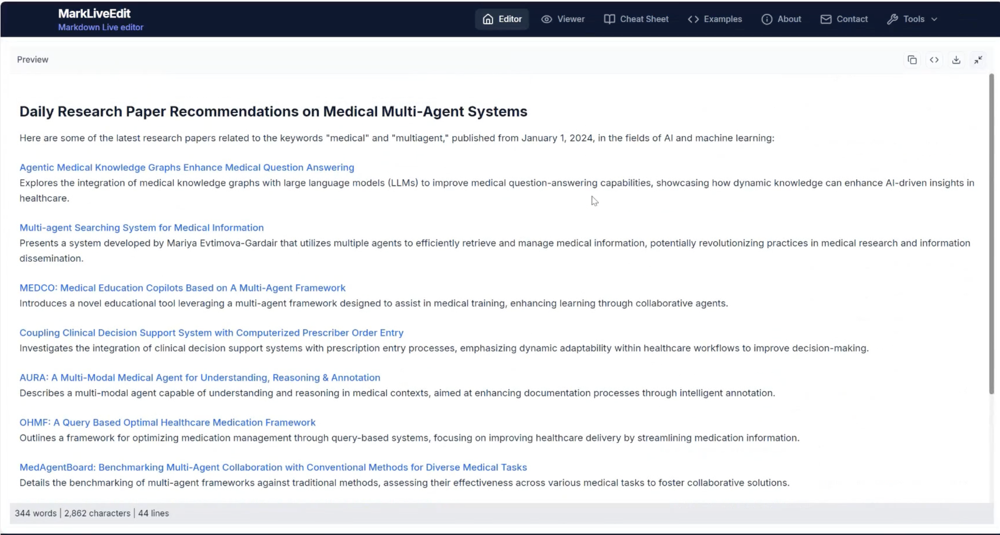

<!-- Add logo here -->
<div align="center">
  <a href="https://github.com/EvoAgentX/EvoAgentX">
    
  </a>
</div>

<h2 align="center">
    Building a Self-Evolving Ecosystem of AI Agents
</h2>

<div align="center">

[](https://evoagentx.org/)
[](https://EvoAgentX.github.io/EvoAgentX/)
[](https://discord.gg/XWBZUJFwKe)
[](https://x.com/EvoAgentX)
[](./assets/wechat_info.md)
[](https://star-history.com/#EvoAgentX/EvoAgentX)
[](https://github.com/EvoAgentX/EvoAgentX/fork)
[](https://github.com/EvoAgentX/EvoAgentX/blob/main/LICENSE)
<!-- [](https://EvoAgentX.github.io/EvoAgentX/) -->
<!-- [](https://huggingface.co/EvoAgentX) -->
</div>

<div align="center">

<h3 align="center">

<a href="./README.md" style="text-decoration: underline;">English</a> | <a href="./README-zh.md">简体中文</a>

</h3>

</div>


## What is EvoAgentX
EvoAgentX is an open-source framework for building, evaluating, and evolving LLM-based agents or agentic workflows in an automated, modular, and goal-driven manner. At its core, EvoAgentX enables developers and researchers to move beyond static prompt chaining or manual workflow orchestration. It introduces a self-evolving agent ecosystem, where AI agents can be constructed, assessed, and optimized through iterative feedback loops—much like how software is continuously tested and improved.

### ✨ Key Features

- 🧱 **Agent Workflow Autoconstruction**
  
  From a single prompt, EvoAgentX builds structured, multi-agent workflows tailored to the task.

- 🔍 **Built-in Evaluation**
  
  It integrates automatic evaluators to score agent behavior using task-specific criteria.

- 🔁 **Self-Evolution Engine**
  
  Agents don’t just work—they learn. EvoAgentX improves workflows using self-evolving algorithms.
- 🧩 **Plug-and-Play Compatibility**
  
  Easily integrate original [OpenAI](https://github.com/EvoAgentX/EvoAgentX/blob/main/evoagentx/models/openai_model.py) and [qwen](https://github.com/EvoAgentX/EvoAgentX/blob/main/evoagentx/models/aliyun_model.py) or other popular models, including Claude, Deepseek, kimi models through ([LiteLLM](https://github.com/EvoAgentX/EvoAgentX/blob/main/evoagentx/models/litellm_model.py), [siliconflow](https://github.com/EvoAgentX/EvoAgentX/blob/main/evoagentx/models/siliconflow_model.py) or [openrouter](https://github.com/EvoAgentX/EvoAgentX/blob/main/evoagentx/models/openrouter_model.py)). If you want to use LLMs locally deployed on your own machine, you can try LiteLLM. 

- 🧰 **Comprehensive Built-in Tools**
  
  EvoAgentX ships with a rich set of built-in tools that empower agents to interact with real-world environments.

- 🧠 **Memory Module**
  
  EvoAgentX supports both ephemeral (short-term) and persistent (long-term) memory systems.

- 🧑‍💻 **Human-in-the-Loop (HITL) Interactions**
  
  EvoAgentX supports interactive workflows where humans review, correct, and guide agent behavior.


### 🚀 What You Can Do with EvoAgentX

EvoAgentX isn’t just a framework — it’s your **launchpad for real-world AI agents**.

Whether you're an AI researcher, workflow engineer, or startup team, EvoAgentX helps you **go from a vague idea to a fully functional agentic system** — with minimal engineering and maximum flexibility.

Here’s how:

- 🔍 **Struggling to improve your workflows?**  
  EvoAgentX can **automatically evolve and optimize your agentic workflows** using SOTA self-evolving algorithms, driven by your dataset and goals.
- 🧑‍💻 **Want to supervise the agent and stay in control?**  
  Insert yourself into the loop! EvoAgentX supports **Human-in-the-Loop (HITL)** checkpoints, so you can step in, review, or guide the workflow as needed — and step out again.

- 🧠 **Frustrated by agents that forget everything?**  
  EvoAgentX provides **both short-term and long-term memory modules**, enabling your agents to remember, reflect, and improve across interactions.

- ⚙️ **Lost in manual workflow orchestration?**  
  Just describe your goal — EvoAgentX will **automatically assemble a multi-agent workflow** that matches your intent.

- 🌍 **Want your agents to actually *do* things?**  
  With a rich library of built-in tools (search, code, browser, file I/O, APIs, and more), EvoAgentX empowers agents to **interact with the real world**, not just talk about it.


## 🔥 EAX Latest News

- **[Aug 2025]** 🚀 **New Survey Released!**  
  Our team just published a comprehensive survey on **Self-Evolving AI Agents**—exploring how agents can learn, adapt, and optimize over time.  
  👉 [Read it on arXiv](https://arxiv.org/abs/2508.07407)
  👉 [Check the repo](https://github.com/EvoAgentX/Awesome-Self-Evolving-Agents)

- **[July 2025]** 📚 **EvoAgentX Framework Paper is Live!**  
  We officially published the EvoAgentX framework paper on arXiv, detailing our approach to building evolving agentic workflows.  
  👉 [Check it out](https://arxiv.org/abs/2507.03616)

- **[July 2025]** ⭐️ **1,000 Stars Reached!**  
  Thanks to our amazing community, **EvoAgentX** has surpassed 1,000 GitHub stars!

- **[May 2025]** 🚀 **Official Launch!**  
  **EvoAgentX** is now live! Start building self-evolving AI workflows from day one.  
  🔧 [Get Started on GitHub](https://github.com/EvoAgentX/EvoAgentX)

## ⚡ Get Started
- [🔥 Latest News](#-latest-news)
- [⚡ Get Started](#-get-started)
- [Installation](#installation)
- [LLM Configuration](#llm-configuration)
  - [API Key Configuration](#api-key-configuration)
  - [Configure and Use the LLM](#configure-and-use-the-llm)
- [Automatic WorkFlow Generation](#automatic-workflow-generation)
- [EvoAgentX Built-in Tools Summary](#-evoagentx-built-in-tools-summary)
- [Tool-Enabled Workflows Generation](#tool-enabled-workflows-generation)
- [Demo Video](#demo-video)
  - [✨ Final Results](#-final-results)
- [Evolution Algorithms](#evolution-algorithms)
  - [📊 Results](#-results)
- [Applications](#applications)
- [Tutorial and Use Cases](#tutorial-and-use-cases)
- [🗣️ EvoAgentX TALK](#evoagentx-talk)
- [🎯 Roadmap](#-roadmap)  
- [🙋 Support](#-support)
  - [Join the Community](#join-the-community)
  - [Add the meeting to your calendar](#add-the-meeting-to-your-calendar)
  - [Contact Information](#contact-information)
  - [Community Call](#community-call)
- [🙌 Contributing to EvoAgentX](#-contributing-to-evoagentx)
- [📖 Citation](#-citation)
- [📚 Acknowledgements](#-acknowledgements)
- [📄 License](#-license)


## Installation

We recommend installing EvoAgentX using `pip`:

```bash
pip install evoagentx
```
or install from source:

```bash
pip install git+https://github.com/EvoAgentX/EvoAgentX.git
```

For local development or detailed setup (e.g., using conda), refer to the [Installation Guide for EvoAgentX](./docs/installation.md).

<details>
<summary>Example (optional, for local development):</summary>

```bash
git clone https://github.com/EvoAgentX/EvoAgentX.git
cd EvoAgentX
# Create a new conda environment
conda create -n evoagentx python=3.11

# Activate the environment
conda activate evoagentx

# Install the package
pip install -r requirements.txt
# OR install in development mode
pip install -e .
```
</details>

## LLM Configuration

### API Key Configuration 

To use LLMs with EvoAgentX (e.g., OpenAI), you must set up your API key.

<details>
<summary>Option 1: Set API Key via Environment Variable</summary> 

- Linux/macOS: 
```bash
export OPENAI_API_KEY=<your-openai-api-key>
```

- Windows Command Prompt: 
```cmd 
set OPENAI_API_KEY=<your-openai-api-key>
```

-  Windows PowerShell:
```powershell
$env:OPENAI_API_KEY="<your-openai-api-key>" # " is required 
```

Once set, you can access the key in your Python code with:
```python
import os
OPENAI_API_KEY = os.getenv("OPENAI_API_KEY")
```
</details>

<details>
<summary>Option 2: Use .env File</summary> 

- Create a .env file in your project root and add the following:
```bash
OPENAI_API_KEY=<your-openai-api-key>
```

Then load it in Python:
```python
from dotenv import load_dotenv 
import os 

load_dotenv() # Loads environment variables from .env file
OPENAI_API_KEY = os.getenv("OPENAI_API_KEY")
```
</details>
<!-- > 🔐 Tip: Don't forget to add `.env` to your `.gitignore` to avoid committing secrets. -->

### Configure and Use the LLM
Once the API key is set, initialise the LLM with:

```python
from evoagentx.models import OpenAILLMConfig, OpenAILLM

# Load the API key from environment
OPENAI_API_KEY = os.getenv("OPENAI_API_KEY")

# Define LLM configuration
openai_config = OpenAILLMConfig(
    model="gpt-4o-mini",       # Specify the model name
    openai_key=OPENAI_API_KEY, # Pass the key directly
    stream=True,               # Enable streaming response
    output_response=True       # Print response to stdout
)

# Initialize the language model
llm = OpenAILLM(config=openai_config)

# Generate a response from the LLM
response = llm.generate(prompt="What is Agentic Workflow?")
```
> 📖 More details on supported models and config options: [LLM module guide](./docs/modules/llm.md).


## Automatic WorkFlow Generation 
Once your API key and language model are configured, you can automatically generate and execute multi-agent workflows in EvoAgentX.

🧩 Core Steps:
1. Define a natural language goal
2. Generate the workflow with `WorkFlowGenerator`
3. Instantiate agents using `AgentManager`
4. Execute the workflow via `WorkFlow`

💡 Minimal Example:
```python
from evoagentx.workflow import WorkFlowGenerator, WorkFlowGraph, WorkFlow
from evoagentx.agents import AgentManager

goal = "Generate html code for the Tetris game"
workflow_graph = WorkFlowGenerator(llm=llm).generate_workflow(goal)

agent_manager = AgentManager()
agent_manager.add_agents_from_workflow(workflow_graph, llm_config=openai_config)

workflow = WorkFlow(graph=workflow_graph, agent_manager=agent_manager, llm=llm)
output = workflow.execute()
print(output)
```

You can also:
- 📊 Visualise the workflow: `workflow_graph.display()`
- 💾 Save/load workflows: `save_module()` / `from_file()`

> 📂 For a complete working example, check out the [`workflow_demo.py`](https://github.com/EvoAgentX/EvoAgentX/blob/main/examples/workflow_demo.py)


## 🧰 EvoAgentX Built-in Tools Summary
EvoAgentX ships with a comprehensive suite of **built-in tools**, enabling agents to interact with code environments, search engines, databases, filesystems, images, and browsers. These modular toolkits form the backbone of multi-agent workflows and are easy to extend, customize, and test.

Categories include:
- 🧮 Code Interpreters (Python, Docker)
- 🔍 Search & HTTP Requests (Google, Wikipedia, arXiv, RSS)
- 🗂️ Filesystem Utilities (read/write, shell commands)
- 🧠 Databases (MongoDB, PostgreSQL, FAISS)
- 🖼️ Image Tools (analysis, generation)
- 🌐 Browser Automation (low-level & LLM-driven)

We actively welcome contributions from the community!  
Feel free to propose or submit new tools via [pull requests](https://github.com/EvoAgentX/EvoAgentX/pulls) or [discussions](https://github.com/EvoAgentX/EvoAgentX/discussions).


<details>
<summary>Click to expand full table 🔽</summary>

<br>
  
| Toolkit Name | Description | Code File Path | Test File Path |
|--------------|-------------|----------------|----------------|
| **🧰 Code Interpreters** |  |  |  |
| PythonInterpreterToolkit | Safely execute Python code snippets or local .py scripts with sandboxed imports and controlled filesystem access. | [link](evoagentx/tools/interpreter_python.py) | [link](examples/tools/tools_interpreter.py) |
| DockerInterpreterToolkit | Run code (e.g., Python) inside an isolated Docker container—useful for untrusted code, special deps, or strict isolation. | [link](evoagentx/tools/interpreter_docker.py) | [link](examples/tools/tools_interpreter.py) |
| **🧰 Search & Request Tools** |  |  |  |
| WikipediaSearchToolkit | Search Wikipedia and retrieve results with title, summary, full content, and URL. | [link](evoagentx/tools/search_wiki.py) | [link](examples/tools/tools_search.py) |
| GoogleSearchToolkit | Google Custom Search (official API). Requires GOOGLE_API_KEY and GOOGLE_SEARCH_ENGINE_ID. | [link](evoagentx/tools/search_google.py) | [link](examples/tools/tools_search.py) |
| GoogleFreeSearchToolkit | Google-style search without API credentials (lightweight alternative). | [link](evoagentx/tools/search_google_f.py) | [link](examples/tools/tools_search.py) |
| DDGSSearchToolkit | Search using DDGS with multiple backends and privacy-focused results | [link](evoagentx/tools/search_ddgs.py) | [link](examples/tools/tools_search.py) |
| SerpAPIToolkit | Multi-engine search via SerpAPI (Google/Bing/Baidu/Yahoo/DDG) with optional content scraping. Requires SERPAPI_KEY. | [link](evoagentx/tools/search_serpapi.py) | [link](examples/tools/tools_search.py) |
| SerperAPIToolkit | Google search via SerperAPI with content extraction. Requires SERPERAPI_KEY. | [link](evoagentx/tools/search_serperapi.py) | [link](examples/tools/tools_search.py) |
| RequestToolkit | General HTTP client (GET/POST/PUT/DELETE) with params, form, JSON, headers, raw/processed response, and optional save to file. | [link](evoagentx/tools/request.py) | [link](examples/tools/tools_search.py) |
| ArxivToolkit | Search arXiv for research papers (title, authors, abstract, links/categories). | [link](evoagentx/tools/request_arxiv.py) | [link](examples/tools/tools_search.py) |
| RSSToolkit | Fetch RSS feeds (with optional webpage content extraction) and validate feeds. | [link](evoagentx/tools/rss_feed.py) | [link](examples/tools/tools_search.py) |
| GoogleMapsToolkit | Geoinformation retrieval and path planning via Google API service. | [link](evoagentx/tools/google_maps_tool.py) | [link](examples/tools/google_maps_example.py) |
| **🧰 FileSystem Tools** |  |  |  |
| StorageToolkit | File I/O utilities: save/read/append/delete, check existence, list files, list supported formats (pluggable storage backends). | [link](evoagentx/tools/storage_file.py) | [link](examples/tools/tools_files.py) |
| CMDToolkit | Execute shell/CLI commands with working directory and timeout control; returns stdout/stderr/return code. | [link](evoagentx/tools/cmd_toolkit.py) | [link](examples/tools/tools_files.py) |
| FileToolkit | File operations toolkit for managing files and directories | [link](evoagentx/tools/file_tool.py) | [link](examples/tools/tools_files.py) |
| **🧰 Database Tools** |  |  |  |
| MongoDBToolkit | MongoDB operations—execute queries/aggregations, find with filter/projection/sort, update, delete, info. | [link](evoagentx/tools/database_mongodb.py) | [link](examples/tools/tools_database.py) |
| PostgreSQLToolkit | PostgreSQL operations—generic SQL execution, targeted SELECT (find), UPDATE, CREATE, DELETE, INFO. | [link](evoagentx/tools/database_postgresql.py) | [link](examples/tools/tools_database.py) |
| FaissToolkit | Vector database (FAISS) for semantic search—insert documents (auto chunk+embed), query by similarity, delete by id/metadata, stats. | [link](evoagentx/tools/database_faiss.py) | [link](examples/tools/tools_database.py) |
| **🧰 Image Handling Tools** |  |  |  |
| ImageAnalysisToolkit | Vision analysis (OpenRouter GPT-4o family): describe images, extract objects/UI info, answer questions about an image. | [link](evoagentx/tools/OpenAI_Image_Generation.py) | [link](examples/tools/tools_images.py) |
| OpenAIImageGenerationToolkit | Text-to-image via OpenAI (DALL·E family) with size/quality/style controls. | [link](evoagentx/tools/OpenAI_Image_Generation.py) | [link](examples/tools/tools_images.py) |
| FluxImageGenerationToolkit | Text-to-image via Flux Kontext Max (BFL) with aspect ratio, seed, format, prompt upsampling, and safety tolerance. | [link](evoagentx/tools/flux_image_generation.py) | [link](examples/tools/tools_images.py) |
| **🧰 Browser Tools** |  |  |  |
| BrowserToolkit | Fine-grained browser automation: initialize, navigate, type, click, resnapshot page, read console logs, and close. | [link](evoagentx/tools/browser_tool.py) | [link](examples/tools/tools_browser.py) |
| BrowserUseToolkit | High-level, natural-language browser automation (navigate, fill forms, click, search, etc.) driven by an LLM. | [link](evoagentx/tools/browser_use.py) | [link](examples/tools/tools_browser.py) |

</details>

**EvoAgentX also supports MCP tools.**  
Check out our [tutorial](https://github.com/EvoAgentX/EvoAgentX/blob/main/docs/tutorial/mcp.md) to learn how to configure your preferred MCP tools with EvoAgentX.

## Tool-Enabled Workflows Generation:

In more advanced scenarios, your workflow agents may need to use external tools. EvoAgentX allows Automatic tool integration: Provide a list of toolkits to WorkFlowGenerator. The generator will consider these and include them in the agents if appropriate.

For instance, to enable an Arxiv toolkit:
```python
from evoagentx.tools import ArxivToolkit

# Initialize a command-line toolkit for file operations
arxiv_toolkit = ArxivToolkit()

# Generate a workflow with the toolkit available to agents
wf_generator = WorkFlowGenerator(llm=llm, tools=[arxiv_toolkit])
workflow_graph = wf_generator.generate_workflow(goal="Find and summarize the latest research on AI in the field of finance on arXiv")

# Instantiate agents with access to the toolkit
agent_manager = AgentManager(tools=[arxiv_toolkit])
agent_manager.add_agents_from_workflow(workflow_graph, llm_config=openai_config)

workflow = WorkFlow(graph=workflow_graph, agent_manager=agent_manager, llm=llm)
output = workflow.execute()
print(output)
```

In this setup, the workflow generator may assign the `ArxivToolkit` to relevant agents, enabling them to execute shell commands as part of the workflow (e.g. creating directories and files)

## Human-in-the-Loop (HITL) Support:

In advanced scenarios, EvoAgentX supports integrating human-in-the-loop interactions within your agent workflows. This means you can pause an agent’s execution for manual approval or inject user-provided input at key steps, ensuring critical decisions are vetted by a human when needed.

All human interactions are managed through a central `HITLManager` instance. The HITL module includes specialized agents like `HITLInterceptorAgent` for approval gating and `HITLUserInputCollectorAgent` for collecting user data.

For instance, to require human approval before an email-sending agent executes its action:
```python
from evoagentx.hitl import HITLManager, HITLInterceptorAgent, HITLInteractionType, HITLMode

hitl_manager = HITLManager()
hitl_manager.activate()  # Enable HITL (disabled by default)

# Interceptor agent to approve/reject the DummyEmailSendAction of DataSendingAgent
interceptor = HITLInterceptorAgent(
    target_agent_name="DataSendingAgent",
    target_action_name="DummyEmailSendAction",
    interaction_type=HITLInteractionType.APPROVE_REJECT,
    mode=HITLMode.PRE_EXECUTION    # ask before action runs
)
# Map the interceptor’s output field back to the workflow’s input field for continuity
hitl_manager.hitl_input_output_mapping = {"human_verified_data": "extracted_data"}

# Add the interceptor to the AgentManager and include HITL in the workflow execution
agent_manager.add_agent(interceptor)
workflow = WorkFlow(graph=workflow_graph, agent_manager=agent_manager, llm=llm, hitl_manager=hitl_manager)
```
When this interceptor triggers, the workflow will pause and prompt in the console for `[a]pprove` or `[r]eject` before continuing. If approved, the flow proceeds using the human-verified data; if rejected, the action is skipped or handled accordingly.

> 📂 For a complete working example, check out the [`tutorial
/hitl.md`](https://github.com/EvoAgentX/EvoAgentX/blob/615b06d29264f47e58a6780bd24f0e73cbf7deee/docs/tutorial/hitl.md)

## Demo Video


[](https://www.youtube.com/watch?v=8ALcspHOe0o)
[](https://www.bilibili.com/video/BV1AjahzRECi/?vd_source=02f8f3a7c8865b3af6378d9680393f5a)

<div align="center">
  <video src="https://github.com/user-attachments/assets/65af8cce-43ad-4e81-ab8d-fc085a7fdc05.mp4" autoplay loop muted playsinline width="600">
    Your browser does not support the video tag.
  </video>
</div>

In this demo, we showcase the workflow generation and execution capabilities of EvoAgentX through two examples:

- **Application 1: Financial Information Agentic Workflow**
- 
  In this example, we use a workflow generated by EvoAgentX to collect public information about a company based on a given index.  
  The collected data includes the overall market index, the company’s current stock price, institutional buy/sell activity, and more.  
  Finally, the workflow generates an **HTML report** summarizing the information and providing a buy/sell/hold recommendation. This workflow is only an alpha version.
  If you're interested in turning it into a **truly practical investment assistant**, you can consider integrating more financial indicators and analytical tools—and let these tools join your
  workflow through agents! Check [here](https://github.com/EvoAgentX/EvoAgentX/blob/main/examples/workflow/invest/stock_analysis.py) to try this workflow.
  
- **Application 2: ArXiv Research Summarizer Workflow**

  This workflow, generated by EvoAgentX and powered by the ArXiv MCP tool, can retrieve and summarize relevant papers from arXiv based on your provided keywords and selected time range.  
  If you're interested, you can even **extend this workflow beyond arXiv**, integrating it with other academic search platforms like **Google Scholar**, and turn it into a fully functional research assistant application! Check [here](https://github.com/EvoAgentX/EvoAgentX/blob/main/examples/workflow/arxiv_workflow.py) to play with this workflow. 

### ✨ Final Results

<table>
  <tr>
    <td align="center">
      <br>
      <strong>Application&nbsp;1:</strong><br>Stock Recommendation
    </td>
    <td align="center">
      <br>
      <strong>Application&nbsp;2:</strong><br>Arxiv Daily Paper Recommendation
    </td>
  </tr>
</table>

## Evolution Algorithms 

We have integrated some effective agent/workflow evolution algorithms into EvoAgentX:

| **Algorithm** | **Description** | **Link** |
|---------------|-----------------|----------|
| **TextGrad**  | Gradient-based optimization for LLM prompts and reasoning chains, enabling differentiable planning. | [📄 Nature (2025)](https://www.nature.com/articles/s41586-025-08661-4) |
| **MIPRO**     | Model-agnostic Iterative Prompt Optimization using black-box evaluations and adaptive reranking. | [📄 arXiv:2406.11695](https://arxiv.org/abs/2406.11695) |
| **AFlow**     | Reinforcement learning-inspired agent workflow evolution using Monte Carlo Tree Search. | [📄 arXiv:2410.10762](https://arxiv.org/abs/2410.10762) |
| **EvoPrompt**     | EvoPrompt dynamically refines prompts via feedback-driven evolution to enhance agent performance and adaptability. | [📄 arXiv:2309.08532](https://arxiv.org/abs/2309.08532) |


**Please suggest the latest self-evolving algorithm by submitting an issue or a Pull Request.**

To evaluate the performance, we use them to optimize the same agent system on three different tasks: multi-hop QA (HotPotQA), code generation (MBPP) and reasoning (MATH). We randomly sample 50 examples for validation and other 100 examples for testing. 

> Tip: We have integrated these benchmark and evaluation code in EvoAgentX. Please refer to the [benchmark and evaluation tutorial](https://github.com/EvoAgentX/EvoAgentX/blob/main/docs/tutorial/benchmark_and_evaluation.md) for more details.

### 📊 Results 

| Method   | HotPotQA<br>(F1%) | MBPP<br>(Pass@1 %) | MATH<br>(Solve Rate %) |
|----------|--------------------|---------------------|--------------------------|
| Original | 63.58              | 69.00               | 66.00                    |
| TextGrad | 71.02              | 71.00               | 76.00                    |
| AFlow    | 65.09              | 79.00               | 71.00                    |
| MIPRO    | 69.16              | 68.00               | 72.30       

Please refer to the `examples/optimization` folder for more details. 

## Applications 

We use our framework to optimize existing multi-agent systems on the [GAIA](https://huggingface.co/spaces/gaia-benchmark/leaderboard) benchmark. We select [Open Deep Research](https://github.com/huggingface/smolagents/tree/main/examples/open_deep_research) and [OWL](https://github.com/camel-ai/owl), two representative multi-agent framework from the GAIA leaderboard that is open-source and runnable. 

We apply EvoAgentX to optimize their prompts. The performance of the optimized agents on the GAIA benchmark validation set is shown in the figure below.

<table>
  <tr>
    <td align="center" width="50%">
      <br>
      <strong>Open Deep Research</strong>
    </td>
    <td align="center" width="50%">
      <br>
      <strong>OWL Agent</strong>
    </td>
  </tr>
</table>

> Full Optimization Reports: [Open Deep Research](https://github.com/eax6/smolagents) and [OWL](https://github.com/TedSIWEILIU/owl).  

## Tutorial and Use Cases

> 💡 **New to EvoAgentX?** Start with the [Quickstart Guide](./docs/quickstart.md) for a step-by-step introduction.


Explore how to effectively use EvoAgentX with the following resources:

| Cookbook | Colab Notebook | Description |
|:---|:---|:---|
| **[Build Your First Agent](./docs/tutorial/first_agent.md)** | **[Build Your First Agent](./docs/ColabNotebook/tutorial_notebooks/first_agent.ipynb)** | Quickly create and manage agents with multi-action capabilities. |
| **[Build Your First Workflow](./docs/tutorial/first_workflow.md)** | **[Build Your First Workflow](./docs/ColabNotebook/tutorial_notebooks/first_workflow.ipynb)** | Learn to build collaborative workflows with multiple agents. |
| **[Working with Tools](./docs/tutorial/tools.md)** | **[Working with Tools](./docs/ColabNotebook/tutorial_notebooks/tools.ipynb)** | Master EvoAgentX's powerful tool ecosystem for agent interactions |
| **[Automatic Workflow Generation](./docs/quickstart.md#automatic-workflow-generation-and-execution)** | **[Automatic Workflow Generation](./docs/ColabNotebook/tutorial_notebooks/quickstart.ipynb)** | Automatically generate workflows from natural language goals. |
| **[Benchmark and Evaluation Tutorial](./docs/tutorial/benchmark_and_evaluation.md)** | **[Benchmark and Evaluation Tutorial](./docs/ColabNotebook/tutorial_notebooks/benchmark_and_evaluation.ipynb)** | Evaluate agent performance using benchmark datasets. |
| **[TextGrad Optimizer Tutorial](./docs/tutorial/textgrad_optimizer.md)** | **[TextGrad Optimizer Tutorial](./docs/ColabNotebook/tutorial_notebooks/textgrad_optimizer.ipynb)** | Automatically optimise the prompts within multi-agent workflow with TextGrad. |
| **[AFlow Optimizer Tutorial](./docs/tutorial/aflow_optimizer.md)** | **[AFlow Optimizer Tutorial](./docs/ColabNotebook/tutorial_notebooks/aflow_optimizer.ipynb)** | Automatically optimise both the prompts and structure of multi-agent workflow with AFlow. |
| **[Human-In-The-Loop support](./docs/tutorial/hitl.md)** | | Enable HITL functionalities in your WorkFlow.
<!-- | **[SEW Optimizer Tutorial](./docs/tutorial/sew_optimizer.md)** | Create SEW (Self-Evolving Workflows) to enhance agent systems. | -->

🛠️ Follow the tutorials to build and optimize your EvoAgentX workflows.

🚀 We're actively working on expanding our library of use cases and optimization strategies. **More coming soon — stay tuned!**


## 🗣️ EvoAgentX TALK

EvoAgentX regularly invites leading researchers to give guest lectures on cutting-edge AI topics.  
Below is a running log of scheduled and completed talks:

| Speaker | Topic | Date | Meeting Video |
|---|---|---|---|
| [Hengzhe Zhang](https://hengzhe-zhang.github.io/) | Genetic Programming: From Evolutionary Algorithms to the LLM Era | 2025-08-10 | [YouTube](https://www.youtube.com/watch?v=naja_kDYc_Y) |
| [Guibin Zhang](https://www.guibinz.top/) | G-Memory: Tracing Hierarchical Memory for Multi-Agent Systems | 2025-09-28 | [YouTube](https://www.youtube.com/watch?v=xzqZsZWfabw&t=3s) |
| [Guanting Dong](https://dongguanting.github.io/) | Agentic Reinforced Policy Optimization | 2025-10-30 |  [YouTube](https://www.youtube.com/watch?v=UB-FL5JFXJY)  |


## 🎯 Roadmap
- [ ] **Modularize Evolution Algorithms**: Abstract optimization algorithms into plug-and-play modules that can be easily integrated into custom workflows. 
- [ ] **Develop Task Templates and Agent Modules**: Build reusable templates for typical tasks and standardized agent components to streamline application development.
- [ ] **Integrate Self-Evolving Agent Algorithms**: Incorporate more recent and advanced agent self-evolution across multiple dimensions, including prompt tuning, workflow structures, and memory modules. 
- [ ] **Enable Visual Workflow Editing Interface**: Provide a visual interface for workflow structure display and editing to improve usability and debugging. 


## 🙋 Support

### Join the Community

📢 Stay connected and be part of the **EvoAgentX** journey!  
🚩 Join our community to get the latest updates, share your ideas, and collaborate with AI enthusiasts worldwide.

- [Discord](https://discord.gg/XWBZUJFwKe) — Chat, discuss, and collaborate in real-time.
- [X (formerly Twitter)](https://x.com/EvoAgentX) — Follow us for news, updates, and insights.
- [WeChat](https://github.com/EvoAgentX/EvoAgentX/blob/main/assets/wechat_info.md) — Connect with our Chinese community.

### Add the meeting to your calendar

📅 Click the link below to add the EvoAgentX Weekly Meeting (Sundays, 16:30–17:30 GMT+8) to your calendar:

👉 [Add to your Google Calendar](https://calendar.google.com/calendar/u/0/r/eventedit?text=EvoAgentX+周会（腾讯会议）&dates=20250629T083000Z/20250629T093000Z&details=会议链接：https://meeting.tencent.com/dm/5UuNxo7Detz0&location=Online&recur=RRULE:FREQ=WEEKLY;BYDAY=SU;UNTIL=20270523T093000Z&ctz=Asia/Shanghai)

👉 [Add to your Tencent Meeting](https://meeting.tencent.com/dm/5UuNxo7Detz0)

👉 [Download the EvoAgentX_Weekly_Meeting.ics file](./EvoAgentX_Weekly_Meeting.ics)

### Contact Information

If you have any questions or feedback about this project, please feel free to contact us. We highly appreciate your suggestions!

- **Email:** evoagentx.ai@gmail.com

We will respond to all questions within 2-3 business days.

### Community Call
- [Bilibili](https://space.bilibili.com/3493105294641286/favlist?fid=3584589186&ftype=create&spm_id_from=333.788.0.0)
- [Youtube](https://studio.youtube.com/playlist/PL_kuPS05qA1hyU6cLX--bJ93Km2-md8AA/edit)
## 🙌 Contributing to EvoAgentX
Thanks go to these awesome contributors

<a href="https://github.com/EvoAgentX/EvoAgentX/graphs/contributors">
  
</a>

We appreciate your interest in contributing to our open-source initiative. We provide a document of [contributing guidelines](https://github.com/EvoAgentX/EvoAgentX/blob/main/CONTRIBUTING.md) which outlines the steps for contributing to EvoAgentX. Please refer to this guide to ensure smooth collaboration and successful contributions. 🤝🚀

[](https://www.star-history.com/#EvoAgentX/EvoAgentX&Date)

## 📖 Citation

Please consider citing our work if you find EvoAgentX helpful:

📄 [EvoAgentX](https://arxiv.org/abs/2507.03616)
📄 [Survey Paper](https://arxiv.org/abs/2508.07407)

```bibtex
@article{wang2025evoagentx,
  title={EvoAgentX: An Automated Framework for Evolving Agentic Workflows},
  author={Wang, Yingxu and Liu, Siwei and Fang, Jinyuan and Meng, Zaiqiao},
  journal={arXiv preprint arXiv:2507.03616},
  year={2025}
}
@article{fang202survey,
      title={A Comprehensive Survey of Self-Evolving AI Agents: A New Paradigm Bridging Foundation Models and Lifelong Agentic Systems}, 
      author={Jinyuan Fang and Yanwen Peng and Xi Zhang and Yingxu Wang and Xinhao Yi and Guibin Zhang and Yi Xu and Bin Wu and Siwei Liu and Zihao Li and Zhaochun Ren and Nikos Aletras and Xi Wang and Han Zhou and Zaiqiao Meng},
      year={2025},
      journal={arXiv preprint arXiv:2508.07407},
      url={https://arxiv.org/abs/2508.07407}, 
}
```

## 📚 Acknowledgements 
This project builds upon several outstanding open-source projects: [AFlow](https://github.com/FoundationAgents/MetaGPT/tree/main/metagpt/ext/aflow), [TextGrad](https://github.com/zou-group/textgrad), [DSPy](https://github.com/stanfordnlp/dspy), [EvoPrompt](https://github.com/beeevita/EvoPrompt), [LiveCodeBench](https://github.com/LiveCodeBench/LiveCodeBench)and more. We would like to thank the developers and maintainers of these frameworks for their valuable contributions to the open-source community.

## 📄 License

Source code in this repository is made available under the [MIT License](./LICENSE).
