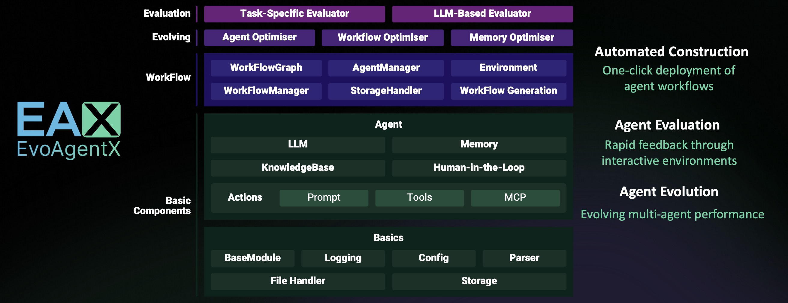

# **EvoAgentX**

<p align="center" style="font-size: 1.0rem;">
  <em>An automated framework for evaluating and evolving agentic workflows.</em>
</p>

<p align="center">
  
</p>


## What is EvoAgentX
EvoAgentX is an open-source framework for building, evaluating, and evolving LLM-based agents or agentic workflows in an automated, modular, and goal-driven manner.

At its core, EvoAgentX enables developers and researchers to move beyond static prompt chaining or manual workflow orchestration. It introduces a self-evolving agent ecosystem, where AI agents can be constructed, assessed, and optimized through iterative feedback loops—much like how software is continuously tested and improved.

### ✨ Key Features

- 🧱 **Agent Workflow Autoconstruction**
  
  From a single prompt, EvoAgentX builds structured, multi-agent workflows tailored to the task.

- 🔍 **Built-in Evaluation**
  
  It integrates automatic evaluators to score agent behavior using task-specific criteria.

- 🔁 **Self-Evolution Engine**
  
  Agents don’t just work—they learn. EvoAgentX evolves workflows using optimization strategies like retrieval augmentation, mutation, and guided search.

- 🧩 **Plug-and-Play Compatibility**
  
  Easily integrate original [OpenAI](https://github.com/EvoAgentX/EvoAgentX/blob/main/evoagentx/models/openai_model.py) and [qwen](https://github.com/EvoAgentX/EvoAgentX/blob/main/evoagentx/models/aliyun_model.py) or other popular models, including Claude, Deepseek, kimi models through ([LiteLLM](https://github.com/EvoAgentX/EvoAgentX/blob/main/evoagentx/models/litellm_model.py), [siliconflow](https://github.com/EvoAgentX/EvoAgentX/blob/main/evoagentx/models/siliconflow_model.py) or [openrouter](https://github.com/EvoAgentX/EvoAgentX/blob/main/evoagentx/models/openrouter_model.py)). If you want to use LLMs locally deployed on your own machine, you can try LiteLLM. 

- 🧰 **Comprehensive Built-in Tools**
  
  EvoAgentX ships with a rich set of built-in tools that empower agents to interact with real-world environments.

- 🧠 **Memory Module**
  
  EvoAgentX supports both ephemeral (short-term) and persistent (long-term) memory systems.

- 🧑‍💻 **Human-in-the-Loop (HITL) Interactions**
  
  EvoAgentX supports interactive workflows where humans review, correct, and guide agent behavior.


### 🚀 What You Can Do with EvoAgentX

EvoAgentX isn’t just a framework — it’s your **launchpad for real-world AI agents**.

Whether you're an AI researcher, workflow engineer, or startup team, EvoAgentX helps you **go from a vague idea to a fully functional agentic system** — with minimal engineering and maximum flexibility.

Here’s how:


## 🔥 EAX Latest News

- **[Aug 2025]** 🚀 **New Survey Released!**  
  Our team just published a comprehensive survey on **Self-Evolving AI Agents**—exploring how agents can learn, adapt, and optimize over time.  
  👉 [Read it on arXiv](https://arxiv.org/abs/2508.07407)

- **[July 2025]** 📚 **EvoAgentX Framework Paper is Live!**  
  We officially published the EvoAgentX framework paper on arXiv, detailing our approach to building evolving agentic workflows.  
  👉 [Check it out](https://arxiv.org/abs/2507.03616)

- **[July 2025]** ⭐️ **1,000 Stars Reached!**  
  Thanks to our amazing community, **EvoAgentX** has surpassed 1,000 GitHub stars!

- **[May 2025]** 🚀 **Official Launch!**  
  **EvoAgentX** is now live! Start building self-evolving AI workflows from day one.  
  🔧 [Get Started on GitHub](https://github.com/EvoAgentX/EvoAgentX)

## 🎥 Demo Video

[](https://www.youtube.com/watch?v=8ALcspHOe0o)
[](https://www.bilibili.com/video/BV1AjahzRECi/?vd_source=02f8f3a7c8865b3af6378d9680393f5a)

<div align="center">
  <iframe width="600" height="338"
          src="https://www.youtube.com/embed/8ALcspHOe0o"
          title="YouTube video player" frameborder="0"
          allow="accelerometer; autoplay; clipboard-write; encrypted-media; gyroscope; picture-in-picture; web-share"
          allowfullscreen>
  </iframe>
</div>


In this demo, we showcase the workflow generation and execution capabilities of EvoAgentX through two examples:

- **Application 1: Financial Information Agentic Workflow**
  In this example, we use a workflow generated by EvoAgentX to collect public information about a company based on a given index.
  
  The collected data includes the overall market index, the company’s current stock price, institutional buy/sell activity, and more.
  
  Finally, the workflow generates an **HTML report** summarizing the information and providing a buy/sell/hold recommendation. This workflow is only an alpha version.
  
  If you're interested in turning it into a **truly practical investment assistant**, you can consider integrating more financial indicators and analytical tools—and let these tools join your workflow through agents! Check [here](https://github.com/EvoAgentX/EvoAgentX/blob/main/examples/workflow/invest/stock_analysis.py) to try this workflow.
  
- **Application 2: ArXiv Research Summarizer Workflow**

  This workflow, generated by EvoAgentX and powered by the ArXiv MCP tool, can retrieve and summarize relevant papers from arXiv based on your provided keywords and selected time range.
   
  If you're interested, you can even **extend this workflow beyond arXiv**, integrating it with other academic search platforms like **Google Scholar**, and turn it into a fully functional research assistant application! Check [here](https://github.com/EvoAgentX/EvoAgentX/blob/main/examples/workflow/arxiv_workflow.py) to play with this workflow. 


## 🧰 EvoAgentX Built-in Tools Overview
EvoAgentX ships with a comprehensive suite of **built-in tools**, enabling agents to interact with code environments, search engines, databases, filesystems, images, and browsers. These modular toolkits form the backbone of multi-agent workflows and are easy to extend, customize, and test.

Categories include:
- 🧮 **Code Interpreters (Python, Docker)**

- 🔍 **Search & HTTP Requests (Google, Wikipedia, arXiv, RSS)**
  
- 🗂️ **Filesystem Utilities (read/write, shell commands)**
  
- 🧠 **Databases (MongoDB, PostgreSQL, FAISS)**
  
- 🖼️ **Image Tools (analysis, generation)**
  
- 🌐 **Browser Automation (low-level & LLM-driven)**

Check [here](https://github.com/EvoAgentX/EvoAgentX/blob/main/docs/tutorial/tools.md) for the full list of available tools.

We actively welcome contributions from the community!  
Feel free to propose or submit new tools via [pull requests](https://github.com/EvoAgentX/EvoAgentX/pulls) or [discussions](https://github.com/EvoAgentX/EvoAgentX/discussions).


## 🎯 Roadmap
- **Modularize Evolution Algorithms**: Abstract optimization algorithms into plug-and-play modules that can be easily integrated into custom workflows. 
- **Develop Task Templates and Agent Modules**: Build reusable templates for typical tasks and standardized agent components to streamline application development.
- **Integrate Self-Evolving Agent Algorithms**: Incorporate more recent and advanced agent self-evolution across multiple dimensions, including prompt tuning, workflow structures, and memory modules. 
- **Enable Visual Workflow Editing Interface**: Provide a visual interface for workflow structure display and editing to improve usability and debugging. 


## 🙋 Support

### Join the Community

📢 Stay connected and be part of the **EvoAgentX** journey!  
🚩 Join our community to get the latest updates, share your ideas, and collaborate with AI enthusiasts worldwide.

- [Discord](https://discord.gg/XWBZUJFwKe) — Chat, discuss, and collaborate in real-time.
- [X (formerly Twitter)](https://x.com/EvoAgentX) — Follow us for news, updates, and insights.
- [WeChat](https://github.com/EvoAgentX/EvoAgentX/blob/main/assets/wechat_info.md) — Connect with our Chinese community.

### Add the meeting to your calendar

📅 Click the link below to add the EvoAgentX Weekly Meeting (Sundays, 16:30–17:30 GMT+8) to your calendar:

👉 [Add to your Google Calendar](https://calendar.google.com/calendar/u/0/r/eventedit?text=EvoAgentX+周会（腾讯会议）&dates=20250629T083000Z/20250629T093000Z&details=会议链接：https://meeting.tencent.com/dm/5UuNxo7Detz0&location=Online&recur=RRULE:FREQ=WEEKLY;BYDAY=SU;UNTIL=20270523T093000Z&ctz=Asia/Shanghai)

👉 [Add to your Tencent Meeting](https://meeting.tencent.com/dm/5UuNxo7Detz0)

👉 [Download the EvoAgentX_Weekly_Meeting.ics file](./EvoAgentX_Weekly_Meeting.ics)

### Contact Information

If you have any questions or feedback about this project, please feel free to contact us. We highly appreciate your suggestions!

- **Email:** evoagentx.ai@gmail.com

We will respond to all questions within 2-3 business days.

### Community Call
- [Bilibili](https://space.bilibili.com/3493105294641286/favlist?fid=3584589186&ftype=create&spm_id_from=333.788.0.0)
- [Youtube](https://studio.youtube.com/playlist/PL_kuPS05qA1hyU6cLX--bJ93Km2-md8AA/edit)
## 🙌 Contributing to EvoAgentX
Thanks go to these awesome contributors

<a href="https://github.com/EvoAgentX/EvoAgentX/graphs/contributors">
  
</a>

We appreciate your interest in contributing to our open-source initiative. We provide a document of [contributing guidelines](https://github.com/EvoAgentX/EvoAgentX/blob/main/CONTRIBUTING.md) which outlines the steps for contributing to EvoAgentX. Please refer to this guide to ensure smooth collaboration and successful contributions. 🤝🚀

[](https://www.star-history.com/#EvoAgentX/EvoAgentX&Date)

## 📖 Citation

Please consider citing our work if you find EvoAgentX helpful:

📄 [EvoAgentX](https://arxiv.org/abs/2507.03616)
📄 [Survey Paper](https://arxiv.org/abs/2508.07407)

```bibtex
@article{wang2025evoagentx,
  title={EvoAgentX: An Automated Framework for Evolving Agentic Workflows},
  author={Wang, Yingxu and Liu, Siwei and Fang, Jinyuan and Meng, Zaiqiao},
  journal={arXiv preprint arXiv:2507.03616},
  year={2025}
}
@article{fang202survey,
      title={A Comprehensive Survey of Self-Evolving AI Agents: A New Paradigm Bridging Foundation Models and Lifelong Agentic Systems}, 
      author={Jinyuan Fang and Yanwen Peng and Xi Zhang and Yingxu Wang and Xinhao Yi and Guibin Zhang and Yi Xu and Bin Wu and Siwei Liu and Zihao Li and Zhaochun Ren and Nikos Aletras and Xi Wang and Han Zhou and Zaiqiao Meng},
      year={2025},
      journal={arXiv preprint arXiv:2508.07407},
      url={https://arxiv.org/abs/2508.07407}, 
}
```

