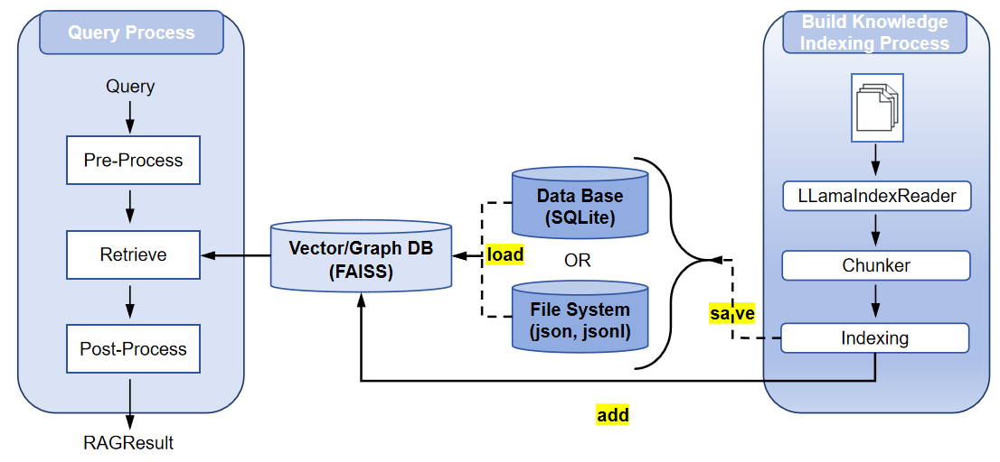

# RAGEngine Module Documentation

## Overview

The `RAGEngine` module is the core component of the Retrieval-Augmented Generation (RAG) system, designed to manage document indexing, storage, and retrieval for efficient information access. Built on top of LlamaIndex, it integrates with various storage backends (e.g., SQLite, FAISS, Neo4j) and supports multiple index types (e.g., vector, graph). This module is part of a long-term memory management framework, enabling agents to process and query large datasets effectively.

### Purpose
The `RAGEngine` serves as the central interface for:
- **Document Processing**: Loading and chunking documents from various formats (e.g., PDF, text).
- **Indexing**: Creating and managing indices for efficient retrieval.
- **Retrieval**: Querying indexed data with support for metadata filtering and similarity-based search.
- **Storage Management**: Persisting indices to files or databases for scalability.

It is designed to integrate with `StorageHandler` and `MemoryManager` components, making it suitable for agent systems requiring contextual knowledge retrieval.

### Key Features
- **Flexible Document Loading**: Supports loading files from directories with customizable filters (e.g., file suffixes, exclusion lists).
- **Chunking and Embedding**: Automatically chunks documents and generates embeddings using configurable models (e.g., OpenAI’s `text-embedding-ada-002`).
- **Multi-Index Support**: Handles different index types (vector, graph) for diverse retrieval needs.
- **Advanced Retrieval**: Supports metadata filters, similarity cutoffs, and keyword-based queries, with asynchronous and multi-threaded retrieval.
- **Storage Integration**: Seamlessly integrates with SQLite for metadata, vector stores like FAISS for embeddings and graph stores like neo4j for relations of the entity.
- **Persistence**: Saves and loads indices to/from files or databases, ensuring data durability.
- **Error Handling**: Robust logging and exception handling for reliable operation.

## RAG Pipeline Overview

The RAG pipeline in `RAGEngine` consists of four main stages, ensuring efficient processing and retrieval of information:

1. **Document Reading**: Loads documents from specified file paths or directories using `LLamaIndexReader`. Files (e.g., PDF, text, Markdown) are processed with configurable options like recursive directory reading, file suffix filtering, and custom metadata extraction.
2. **Chunking**: Splits documents into smaller chunks using a specified chunking strategy (e.g., simple, semantic, hierarchical). This ensures manageable text segments for embedding and retrieval.
3. **Vector Index Construction**: Generates embeddings for chunks using an embedding model (e.g., OpenAI, ollama or Hugging Face) and builds indices (e.g., vector/graph index) for efficient storage and retrieval. Indices are stored in a backend like FAISS, Neo4j and SQLite.
4. **Retrieval**: Processes queries using a retriever (e.g., vector or graph retriever), applies preprocessing (e.g., HyDE query transform), retrieves relevant chunks, and post-processes results (e.g., reranking or filtering by metadata).

<p align="center">
  
</p>

## Configuration Details

The `RAGEngine` relies on a `RAGConfig` object that encapsulates configurations for each stage of the RAG pipeline. Below are the detailed configurations and their parameters.

### ReaderConfig
Controls the document reading stage.

| Parameter | Type | Default | Description |
|-----------|------|---------|-------------|
| `recursive` | `bool` | `False` | Whether to recursively read directories. Set to `True` to include subdirectories. |
| `exclude_hidden` | `bool` | `True` | Excludes hidden files and directories (e.g., those starting with a dot). |
| `num_files_limit` | `Optional[int]` | `None` | Maximum number of files to read. Set to `None` for no limit. |
| `custom_metadata_function` | `Optional[Callable]` | `None` | Custom function to extract metadata from files, allowing user-defined metadata fields. |
| `extern_file_extractor` | `Optional[Dict[str, Any]]` | `None` | External file extractors for specific file types (e.g., PDF, Word). |
| `errors` | `str` | `"ignore"` | Error handling strategy: `"ignore"` skips invalid files, `"strict"` raises exceptions. |
| `encoding` | `str` | `"utf-8"` | File encoding for reading text files. |

### ChunkerConfig
Configures the document chunking stage.

| Parameter | Type | Default | Description |
|-----------|------|---------|-------------|
| `strategy` | `str` | `"simple"` | Chunking strategy: `"simple"`, `"semantic"`, or `"hierarchical"`. Determines how documents are split. |
| `chunk_size` | `int` | `1024` | Maximum size of each chunk in characters. Smaller sizes improve granularity but increase processing time. |
| `chunk_overlap` | `int` | `20` | Number of overlapping characters between chunks to maintain context. |
| `max_chunks` | `Optional[int]` | `None` | Maximum number of chunks per document. Set to `None` for no limit. |

### EmbeddingConfig
Manages the embedding generation stage.

| Parameter | Type | Default | Description |
|-----------|------|---------|-------------|
| `provider` | `str` | `"openai"` | Embedding provider: `"openai"`, `ollama`, `"huggingface"`. Determines the source of the embedding model. |
| `model_name` | `str` | `"text-embedding-ada-002"` | Name of the embedding model (e.g., `"text-embedding-ada-002"` for OpenAI). |
| `api_key` | `Optional[str]` | `None` | API key for the embedding provider, required for providers like OpenAI. |
| `api_url` | `str` | `"https://api.openai.com/v1"` | API URL for the embedding model, used for custom endpoints. |
| `dimensions` | `Optional[int]` | `None` | Dimensions of the embedding model. Must match the vector store configuration. |
| `normalize` | `Optional[bool]` | `True` | Whether to normalize embeddings (applies to Hugging Face models). |
| `device` | `Optional[str]` | `None` | Device for embedding computation (e.g., `"cuda"`, `"cpu"`) for Hugging Face models. |

### IndexConfig
Configures the indexing stage.

| Parameter | Type | Default | Description |
|-----------|------|---------|-------------|
| `index_type` | `str` | `"vector"` | Index type: `"vector"`, `"graph"`, `"summary"`, or `"tree"`. Determines the structure for storing and retrieving data. |

### RetrievalConfig
Controls the retrieval stage, including preprocessing, retrieval, and post-processing.

| Parameter | Type | Default | Description |
|-----------|------|---------|-------------|
| `retrivel_type` | `str` | `"vector"` | Retriever type: `"vector"` or `"graph"`. Specifies the retrieval mechanism. |
| `postprocessor_type` | `str` | `"simple"` | Postprocessor type for reranking or filtering results (e.g., `"simple"`). |
| `top_k` | `int` | `5` | Number of top results to retrieve in a query. |
| `similarity_cutoff` | `Optional[float]` | `0.7` | Minimum similarity score for retrieved chunks. Filters out low-relevance results. |
| `keyword_filters` | `Optional[List[str]]` | `None` | Keywords to filter retrieved chunks, ensuring relevance to specific terms. |
| `metadata_filters` | `Optional[Dict[str, Any]]` | `None` | Metadata filters to refine retrieval (e.g., `{"file_name": "doc.txt"}`). |

## Usage Instructions

### Prerequisites
- Install dependencies: `llama_index`, `pydantic`, and other required libraries.
- Configure environment variables (e.g., `OPENAI_API_KEY` for embedding models). See [Installation Guide for EvoAgentX](../installation.md).
- Ensure a `StorageHandler` instance is configured with appropriate storage backends (e.g., SQLite, FAISS, Neo4j).

### Initialization
Initialize `RAGEngine` with a `RAGConfig` and `StorageHandler`.

```python
from evoagentx.rag.rag import RAGEngine
from evoagentx.rag.rag_config import RAGConfig, ReaderConfig, ChunkerConfig, EmbeddingConfig, IndexConfig, RetrievalConfig
from evoagentx.storages.base import StorageHandler
from evoagentx.storages.storages_config import StoreConfig, VectorStoreConfig, DBConfig

# Configure storage
store_config = StoreConfig(
    dbConfig=DBConfig(db_name="sqlite", path="./data/cache.db"),
    vectorConfig=VectorStoreConfig(vector_name="faiss", dimensions=1536, index_type="flat_l2"),
    graphConfig=None,
    path="./data/indexing"
)
storage_handler = StorageHandler(storageConfig=store_config)

# Configure RAG
rag_config = RAGConfig(
    reader=ReaderConfig(recursive=False, exclude_hidden=True),
    chunker=ChunkerConfig(strategy="simple", chunk_size=512, chunk_overlap=0),
    embedding=EmbeddingConfig(provider="openai", model_name="text-embedding-ada-002", api_key="your-api-key"),
    index=IndexConfig(index_type="vector"),
    retrieval=RetrievalConfig(retrivel_type="vector", postprocessor_type="simple", top_k=10, similarity_cutoff=0.3)
)

# Initialize RAGEngine
rag_engine = RAGEngine(config=rag_config, storage_handler=storage_handler)
```

### Core Functionality Usage

1. **Loading Documents**:
   - Use the `read` method to load and chunk documents into a corpus.
   - Example:
     ```python
     corpus = rag_engine.read(
         file_paths="./data/docs",
         filter_file_by_suffix=[".txt", ".pdf"],
         merge_by_file=False,
         show_progress=True,
         corpus_id="doc_corpus"
     )
     ```

2. **Indexing Documents**:
   - Use the `add` method to index a corpus or node list into a specified index type.
   - Example:
     ```python
     rag_engine.add(index_type="vector", nodes=corpus, corpus_id="doc_corpus")
     ```

3. **Querying**:
   - Use the `query` method to retrieve relevant chunks based on a query string or `Query` object.
   - Example:
     ```python
     from evoagentx.rag.schema import Query
     query = Query(query_str="What is the capital of France?", top_k=5)
     result = rag_engine.query(query, corpus_id="doc_corpus")
     print(result.corpus.chunks)  # Retrieved chunks
     ```

4. **Deleting Nodes or Indices**:
   - Use the `delete` method to remove specific nodes or an entire index.
   - Example:
     ```python
     rag_engine.delete(corpus_id="doc_corpus", node_ids=["node_1", "node_2"])
     rag_engine.delete(corpus_id="doc_corpus", index_type="vector")  # Delete entire index
     ```

5. **Clearing Indices**:
   - Use the `clear` method to remove indices for a specific corpus or all corpora.
   - Example:
     ```python
     rag_engine.clear(corpus_id="doc_corpus")  # Clear specific corpus
     rag_engine.clear()  # Clear all corpora
     ```

6. **Saving Indices**:
   - Use the `save` method to persist indices to files or a database.
   - Example:
     ```python
     rag_engine.save(output_path="./data/indexing", corpus_id="doc_corpus", index_type="vector")
     rag_engine.save(corpus_id="doc_corpus", table="indexing")  # Save to database
     ```

7. **Loading Indices**:
   - Use the `load` method to reconstruct indices from files or a database.
   - Example:
     ```python
     rag_engine.load(source="./data/indexing", corpus_id="doc_corpus", index_type="vector")
     rag_engine.load(corpus_id="doc_corpus", table="indexing")  # Load from database
     ```

### Usage Example
The following example demonstrates using `RAGEngine` to process a HotPotQA dataset, index documents, query, and evaluate retrieval performance. [examples/rag_engine.py](../../examples/rag_engine.py)

```python
import os
import json
import logging
from typing import List, Dict
from collections import defaultdict
from dotenv import load_dotenv

from evoagentx.storages.base import StorageHandler
from evoagentx.rag.rag import RAGEngine
from evoagentx.core.logging import logger
from evoagentx.storages.storages_config import VectorStoreConfig, DBConfig, StoreConfig
from evoagentx.rag.rag_config import RAGConfig, ReaderConfig, ChunkerConfig, IndexConfig, EmbeddingConfig, RetrievalConfig
from evoagentx.rag.schema import Query, Corpus, Chunk, ChunkMetadata
from evoagentx.benchmark.hotpotqa import HotPotQA, download_raw_hotpotqa_data

# Load environment
load_dotenv()

# Download datasets
download_raw_hotpotqa_data("hotpot_dev_distractor_v1.json", "./debug/data/hotpotqa")
datasets = HotPotQA("./debug/data/hotpotqa")

# Initialize StorageHandler
store_config = StoreConfig(
    dbConfig=DBConfig(
        db_name="sqlite",
        path="./debug/data/hotpotqa/cache/test_hotpotQA.sql"
    ),
    vectorConfig=VectorStoreConfig(
        vector_name="faiss",
        dimensions=1536,
        index_type="flat_l2",
    ),
    graphConfig=None,
    path="./debug/data/hotpotqa/cache/indexing"
)
storage_handler = StorageHandler(storageConfig=store_config)

# Initialize RAGEngine
rag_config = RAGConfig(
    reader=ReaderConfig(
        recursive=False, exclude_hidden=True,
        num_files_limit=None, custom_metadata_function=None,
        extern_file_extractor=None,
        errors="ignore", encoding="utf-8"
    ),
    chunker=ChunkerConfig(
        strategy="simple",
        chunk_size=512,
        chunk_overlap=0,
        max_chunks=None
    ),
    embedding=EmbeddingConfig(
        provider="openai",
        model_name="text-embedding-ada-002",
        api_key=os.environ["OPENAI_API_KEY"],
    ),
    index=IndexConfig(index_type="vector"),
    retrieval=RetrievalConfig(
        retrivel_type="vector",
        postprocessor_type="simple",
        top_k=10,  # Retrieve top-10 contexts
        similarity_cutoff=0.3,
        keyword_filters=None,
        metadata_filters=None
    )
)
rag_engine = RAGEngine(config=rag_config, storage_handler=storage_handler)

def create_corpus_from_context(context: List[List], corpus_id: str) -> Corpus:
    """Convert HotPotQA context into a Corpus for indexing."""
    chunks = []
    for title, sentences in context:
        for idx, sentence in enumerate(sentences):
            chunk = Chunk(
                chunk_id=f"{title}_{idx}",
                text=sentence,
                metadata=ChunkMetadata(
                    doc_id=str(idx),
                    corpus_id=corpus_id
                ),
                start_char_idx=0,
                end_char_idx=len(sentence),
                excluded_embed_metadata_keys=[],
                excluded_llm_metadata_keys=[],
                relationships={}
            )
            chunk.metadata.title = title
            chunks.append(chunk)
    return Corpus(chunks=chunks, corpus_id=corpus_id)

def evaluate_retrieval(retrieved_chunks: List[Chunk], supporting_facts: List[List], top_k: int) -> Dict[str, float]:
    """Evaluate retrieved chunks against supporting facts."""
    relevant = {(fact[0], fact[1]) for fact in supporting_facts}
    retrieved = []
    for chunk in retrieved_chunks[:top_k]:
        title = chunk.metadata.title
        sentence_idx = int(chunk.metadata.doc_id)
        retrieved.append((title, sentence_idx))
    hits = sum(1 for r in retrieved if r in relevant)
    precision = hits / top_k if top_k > 0 else 0.0
    recall = hits / len(relevant) if len(relevant) > 0 else 0.0
    f1 = 2 * (precision * recall) / (precision + recall) if (precision + recall) > 0 else 0.0
    mrr = 0.0
    for rank, r in enumerate(retrieved, 1):
        if r in relevant:
            mrr = 1.0 / rank
            break
    hit = 1.0 if hits > 0 else 0.0
    intersection = set((r[0], r[1]) for r in retrieved) & relevant
    union = set((r[0], r[1]) for r in retrieved) | relevant
    jaccard = len(intersection) / len(union) if union else 0.0
    return {
        "precision@k": precision,
        "recall@k": recall,
        "f1@k": f1,
        "mrr": mrr,
        "hit@k": hit,
        "jaccard": jaccard
    }

def run_evaluation(samples: List[Dict], top_k: int = 5) -> Dict[str, float]:
    """Run evaluation on HotPotQA samples."""
    metrics = defaultdict(list)
    for sample in samples:
        question = sample["question"]
        context = sample["context"]
        supporting_facts = sample["supporting_facts"]
        corpus_id = sample["_id"]
        logger.info(f"Processing sample: {corpus_id}, question: {question}")
        corpus = create_corpus_from_context(context, corpus_id)
        logger.info(f"Created corpus with {len(corpus.chunks)} chunks")
        rag_engine.add(index_type="vector", nodes=corpus, corpus_id=corpus_id)
        query = Query(query_str=question, top_k=top_k)
        result = rag_engine.query(query, corpus_id=corpus_id)
        retrieved_chunks = result.corpus.chunks
        logger.info(f"Retrieved {len(retrieved_chunks)} chunks for query")
        sample_metrics = evaluate_retrieval(retrieved_chunks, supporting_facts, top_k)
        for metric_name, value in sample_metrics.items():
            metrics[metric_name].append(value)
        logger.info(f"Metrics for sample {corpus_id}: {sample_metrics}")
        rag_engine.clear(corpus_id=corpus_id)
    avg_metrics = {name: sum(values) / len(values) for name, values in metrics.items()}
    return avg_metrics

if __name__ == "__main__":
    samples = datasets._dev_data[:20]
    print(len(datasets._dev_data))
    avg_metrics = run_evaluation(samples, top_k=5)
    logger.info("Average Metrics:")
    for metric_name, value in avg_metrics.items():
        logger.info(f"{metric_name}: {value:.4f}")
    with open("./debug/data/hotpotqa/evaluation_results.json", "w") as f:
        json.dump(avg_metrics, f, indent=2)
```

## Interface List

| Method | Description | Parameters | Return Value |
|--------|-------------|------------|--------------|
| `__init__` | Initializes the RAGEngine with RAG and storage configurations. | `config: RAGConfig`, `storage_handler: StorageHandler` | None |
| `read` | Loads and chunks documents into a corpus. | `file_paths`, `exclude_files`, `filter_file_by_suffix`, `merge_by_file`, `show_progress`, `corpus_id` | `Corpus` |
| `add` | Adds nodes to an index for a specific corpus. | `index_type`, `nodes`, `corpus_id` | None |
| `delete` | Deletes nodes or an entire index from a corpus. | `corpus_id`, `index_type`, `node_ids`, `metadata_filters` | None |
| `clear` | Clears indices for a specific corpus or all corpora. | `corpus_id` | None |
| `save` | Saves indices to files or a database. | `output_path`, `corpus_id`, `index_type`, `table` | None |
| `load` | Loads indices from files or a database. | `source`, `corpus_id`, `index_type`, `table` | None |
| `query` | Executes a query and returns processed results. | `query`, `corpus_id`, `query_transforms` | `RagResult` |

## Notes
- **Query Transforms**: The `query` method supports optional query transforms for preprocessing, which can be customized to enhance retrieval (e.g., HyDE, query decomposition).
- **Storage Backend**: Ensure `StorageHandler` is properly configured to handle vector and metadata storage.
- **Warning**: Loading indices multiple times may cause issues (e.g., duplicate node insertion in vector stores). Clear indices before reloading.