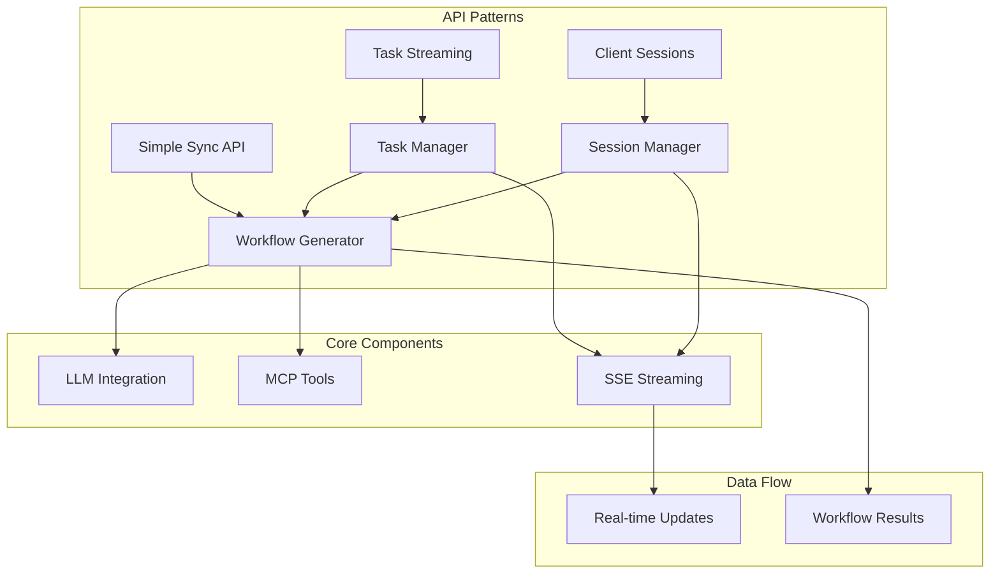

# EvoAgentX Server - Hybrid SSE Workflow Generation API

A powerful, flexible server for AI workflow generation with multiple API patterns to suit different use cases. Choose from simple synchronous APIs, task-based streaming, or persistent client sessions based on your needs.

## 🚀 Features

- **Three API Patterns**: Simple sync, task streaming, and persistent client sessions
- **Real-time Streaming**: Server-Sent Events (SSE) for live progress updates
- **AI Workflow Generation**: LLM-powered workflow creation
- **Concurrent Processing**: Multiple tasks per client session
- **Resource Management**: Automatic session cleanup and monitoring
- **Production Ready**: Error handling, timeouts, and proper resource management

## 🏗️ Architecture Overview



## 📋 Table of Contents

1. [Quick Start](#quick-start)
2. [API Patterns](#api-patterns)
3. [API Reference](#api-reference)
4. [Usage Examples](#usage-examples)
5. [Development](#development)
6. [Architecture Details](#architecture-details)

## 🚀 Quick Start

### Installation

```bash
# Clone the repository
git clone <repository-url>
cd EvoAgentX/server

# Install dependencies
pip install -r requirements.txt

# Set up environment variables
echo "OPENAI_API_KEY=your_openai_key_here" > .env
```

### Running the Server

```bash
# Start the server
python -m server.main

# The server will be available at http://localhost:8001
```

### Test All Patterns

```bash
# Run the comprehensive test suite
python -m server.test_client
```

## 🎯 API Patterns

We offer three distinct patterns for different use cases:

### 1. 🔄 Simple Synchronous API
**Perfect for**: Scripts, CLIs, simple integrations

```python
import requests

response = requests.post('http://localhost:8001/workflow/generate', json={
    "goal": "Create an email notification workflow",
    "llm_config": {
        "model": "gpt-4o-mini",
        "openai_key": "your_key_here",
        "max_tokens": 8000
    }
})

workflow = response.json()
print(f"Generated workflow: {workflow['workflow_graph']}")
```

**Benefits**: ✅ Simplest integration ✅ Standard HTTP ✅ Immediate results  
**Trade-offs**: ❌ Blocks connection ❌ No progress updates ❌ Timeout risk

### 2. 📡 Task-Based Streaming
**Perfect for**: User-facing apps, progress monitoring, async operations

```python
import requests
from sseclient import SSEClient

# Start the task
response = requests.post('http://localhost:8001/stream/workflow/generate', json=config)
task_data = response.json()

# Connect to the task's SSE stream
response = requests.get(f'http://localhost:8001{task_data["stream_url"]}', stream=True)
messages = SSEClient(response)

# Receive real-time updates
for msg in messages.events():
    if msg.event == "complete":
        result = json.loads(msg.data)
        print(f"Workflow: {result['result']['workflow_graph']}")
        break
```

**Benefits**: ✅ Progress updates ✅ Non-blocking ✅ Can reconnect later  
**Use cases**: Web apps, monitoring dashboards, async workflows

### 3. 🔗 Client-Session Streaming
**Perfect for**: Interactive apps, multiple workflows, persistent connections

```python
import requests
from sseclient import SSEClient

# Connect and get persistent session
client_response = requests.post('http://localhost:8001/connect')
client_data = client_response.json()
client_id = client_data["client_id"]

# Open persistent SSE connection
response = requests.get(f'http://localhost:8001{client_data["stream_url"]}', stream=True)
messages = SSEClient(response)

# Start multiple tasks through the same connection
requests.post(f'http://localhost:8001/client/{client_id}/workflow/generate', json=config1)
requests.post(f'http://localhost:8001/client/{client_id}/workflow/generate', json=config2)

# All updates come through the same stream
for msg in messages.events():
    data = json.loads(msg.data)
    task_id = data.get("task_id")
    if data.get("event_type") == "task_completed":
        print(f"Task {task_id} completed: {data['result']['workflow_graph']}")
```

**Benefits**: ✅ Multiple tasks ✅ Persistent connection ✅ Resource efficient  
**Use cases**: Chat interfaces, IDEs, interactive dashboards, workflow builders

## 📚 API Reference

### Core Endpoints

#### Health Check
```http
GET /health
```
Returns server health status.

#### Simple Synchronous Workflow Generation
```http
POST /workflow/generate
Content-Type: application/json

{
    "goal": "Create a data processing workflow",
    "llm_config": {
        "model": "gpt-4o-mini",
        "openai_key": "your_key",
        "max_tokens": 8000
    },
    "mcp_config": {}, // Optional
    "timeout": 120     // Optional
}
```

**Response**:
```json
{
    "success": true,
    "goal": "Create a data processing workflow",
    "workflow_graph": { /* Generated workflow */ },
    "message": "Workflow generated successfully",
    "timestamp": "2024-01-01T12:00:00Z"
}
```

### Task-Based Streaming

#### Start Streaming Task
```http
POST /stream/workflow/generate
Content-Type: application/json

{
    "goal": "Create a workflow",
    "llm_config": { /* LLM configuration */ },
    "timeout": 180
}
```

**Response**:
```json
{
    "task_id": "abc-123",
    "status": "started",
    "stream_url": "/stream/abc-123",
    "task_type": "workflow_generation"
}
```

#### Connect to Task Stream
```http
GET /stream/{task_id}
Accept: text/event-stream
```

**SSE Events**:
```
event: update
data: {"progress": 50, "current_state": "Processing..."}

event: complete
data: {"result": {"workflow_graph": {...}}}
```

### Client-Session Streaming

#### Connect Client
```http
POST /connect
```

**Response**:
```json
{
    "client_id": "xyz-789",
    "stream_url": "/stream/client/xyz-789"
}
```

#### Start Client Task
```http
POST /client/{client_id}/workflow/generate
Content-Type: application/json

{
    "goal": "Create a workflow",
    "llm_config": { /* configuration */ }
}
```

#### Client SSE Stream
```http
GET /stream/client/{client_id}
Accept: text/event-stream
```

**SSE Events**:
```
event: task_started
data: {"task_id": "abc-123", "goal": "..."}

event: task_completed
data: {"task_id": "abc-123", "result": {...}}
```

#### Disconnect Client
```http
DELETE /client/{client_id}
```

### Utility Endpoints

#### List Active Clients
```http
GET /clients
```

## 💡 Usage Examples

### Example 1: Simple Script Integration
```python
#!/usr/bin/env python3
"""Simple workflow generation script"""

import requests
import sys

def generate_workflow(goal):
    config = {
        "goal": goal,
        "llm_config": {
            "model": "gpt-4o-mini",
            "openai_key": "your_key_here",
            "max_tokens": 8000
        }
    }
    
    response = requests.post('http://localhost:8001/workflow/generate', json=config)
    
    if response.status_code == 200:
        result = response.json()
        return result['workflow_graph']
    else:
        print(f"Error: {response.text}")
        return None

if __name__ == "__main__":
    if len(sys.argv) != 2:
        print("Usage: python script.py 'your workflow goal'")
        sys.exit(1)
    
    workflow = generate_workflow(sys.argv[1])
    if workflow:
        print(f"Generated workflow: {workflow}")
```

### Example 2: Progress Monitoring Dashboard
```python
import requests
from sseclient import SSEClient
import threading

class WorkflowDashboard:
    def __init__(self):
        self.active_tasks = {}
    
    def start_workflow(self, goal):
        config = {
            "goal": goal,
            "llm_config": {"model": "gpt-4o-mini", "openai_key": "key"},
            "timeout": 300
        }
        
        response = requests.post('http://localhost:8001/stream/workflow/generate', json=config)
        task_data = response.json()
        task_id = task_data['task_id']
        
        # Start monitoring in background
        threading.Thread(
            target=self._monitor_task, 
            args=(task_id, task_data['stream_url'])
        ).start()
        
        return task_id
    
    def _monitor_task(self, task_id, stream_url):
        response = requests.get(f'http://localhost:8001{stream_url}', stream=True)
        messages = SSEClient(response)
        
        for msg in messages.events():
            data = json.loads(msg.data)
            
            if msg.event == "update":
                progress = data.get('progress', 0)
                self._update_progress(task_id, progress)
            elif msg.event == "complete":
                workflow = data['result']['workflow_graph']
                self._task_completed(task_id, workflow)
                break
    
    def _update_progress(self, task_id, progress):
        print(f"Task {task_id}: {progress}% complete")
    
    def _task_completed(self, task_id, workflow):
        print(f"Task {task_id} completed! Workflow: {workflow}")

# Usage
dashboard = WorkflowDashboard()
task_id = dashboard.start_workflow("Create a data validation workflow")
```

### Example 3: Interactive Workflow Builder
```python
import requests
from sseclient import SSEClient
import threading
import queue

class InteractiveWorkflowBuilder:
    def __init__(self):
        # Connect to persistent session
        response = requests.post('http://localhost:8001/connect')
        self.client_data = response.json()
        self.client_id = self.client_data['client_id']
        
        # Start listening to events
        self.event_queue = queue.Queue()
        self._start_event_listener()
        
        print(f"Connected as client {self.client_id}")
    
    def _start_event_listener(self):
        def listen():
            response = requests.get(f'http://localhost:8001{self.client_data["stream_url"]}', stream=True)
            messages = SSEClient(response)
            
            for msg in messages.events():
                data = json.loads(msg.data)
                self.event_queue.put(data)
        
        thread = threading.Thread(target=listen)
        thread.daemon = True
        thread.start()
    
    def generate_workflow(self, goal):
        config = {
            "goal": goal,
            "llm_config": {"model": "gpt-4o-mini", "openai_key": "key"},
            "timeout": 180
        }
        
        response = requests.post(
            f'http://localhost:8001/client/{self.client_id}/workflow/generate',
            json=config
        )
        
        task_data = response.json()
        task_id = task_data['task_id']
        
        print(f"Started workflow generation: {task_id}")
        return task_id
    
    def wait_for_result(self, task_id):
        """Wait for a specific task to complete and return the result"""
        while True:
            try:
                event = self.event_queue.get(timeout=1)
                
                if (event.get('task_id') == task_id and 
                    event.get('event_type') == 'task_completed'):
                    return event['result']['workflow_graph']
                    
            except queue.Empty:
                continue
    
    def batch_generate(self, goals):
        """Generate multiple workflows concurrently"""
        task_ids = []
        
        # Start all tasks
        for goal in goals:
            task_id = self.generate_workflow(goal)
            task_ids.append(task_id)
        
        # Collect results
        results = {}
        completed = 0
        
        while completed < len(task_ids):
            try:
                event = self.event_queue.get(timeout=1)
                
                if event.get('event_type') == 'task_completed':
                    task_id = event['task_id']
                    if task_id in task_ids:
                        results[task_id] = event['result']['workflow_graph']
                        completed += 1
                        print(f"Completed {completed}/{len(task_ids)} workflows")
                        
            except queue.Empty:
                continue
        
        return results

# Usage
builder = InteractiveWorkflowBuilder()

# Single workflow
task_id = builder.generate_workflow("Create an email workflow")
workflow = builder.wait_for_result(task_id)
print(f"Single workflow: {workflow}")

# Batch workflows
goals = [
    "Create a data validation workflow",
    "Create a reporting workflow", 
    "Create a notification workflow"
]
results = builder.batch_generate(goals)
print(f"Generated {len(results)} workflows")
```

## 🔧 Development

### Project Structure
```
server/
├── api.py              # FastAPI endpoints and SSE handling
├── service.py          # Core workflow generation logic
├── task_manager.py     # Task and session management
├── models.py           # Pydantic data models
├── test_client.py      # Comprehensive test suite
├── main.py            # Server entry point
└── requirements.txt   # Dependencies
```

### Key Components

#### API Layer (`api.py`)
- **FastAPI endpoints** for all three patterns
- **SSE event generation** for real-time streaming
- **Error handling** and validation
- **Session management** endpoints

#### Service Layer (`service.py`)
- **Workflow generation** using LLM integration
- **Task processing** with async patterns
- **Client-aware processing** for session routing
- **LLM configuration** handling

#### Task Management (`task_manager.py`)
- **In-memory storage** (replace with database for production)
- **Session lifecycle** management
- **Event routing** to clients
- **Cleanup and monitoring** utilities

### Adding New Features

1. **New API Endpoints**: Add to `api.py` with proper routing
2. **Processing Logic**: Extend `service.py` for new workflow types
3. **Data Models**: Define in `models.py` using Pydantic
4. **Tests**: Add comprehensive tests to `test_client.py`

### Environment Configuration

```bash
# Required
OPENAI_API_KEY=your_openai_api_key_here

# Optional
SERVER_HOST=0.0.0.0
SERVER_PORT=8001
DEBUG=True
```

## 🏭 Production Considerations

### Scaling
- Replace in-memory storage with Redis/PostgreSQL
- Add load balancing for multiple server instances
- Implement proper session persistence
- Add rate limiting and authentication

### Monitoring
- Use the `/clients` endpoint for session monitoring
- Add metrics collection for task performance
- Implement proper logging with structured formats
- Set up health checks and alerting

### Security
- Add authentication and authorization
- Implement API rate limiting
- Use HTTPS in production
- Validate and sanitize all inputs

### Performance
- Connection pooling for database access
- Async processing for all I/O operations
- Proper error handling and retry logic
- Resource cleanup and memory management

## 🎊 Why This Architecture is Amazing

### 1. **Flexibility**: Three patterns for three different needs
- Simple sync for scripts and CLIs
- Task streaming for user-facing applications
- Client sessions for interactive experiences

### 2. **Scalability**: Built for growth
- Async processing throughout
- Resource-efficient streaming
- Session-based resource management

### 3. **Developer Experience**: Easy to use and extend
- Clear separation of concerns
- Comprehensive test suite
- Detailed documentation and examples

### 4. **Real-time Capabilities**: Live updates everywhere
- SSE streaming for immediate feedback
- Token-by-token streaming ready
- Command-line output streaming ready

### 5. **Production Ready**: Not just a demo
- Proper error handling
- Resource cleanup
- Monitoring capabilities
- Extensible architecture

## 🤝 Contributing

1. Fork the repository
2. Create a feature branch
3. Add tests for new functionality
4. Ensure all tests pass
5. Submit a pull request

## 📄 License

[Add your license information here]

---

**Built with ❤️ for the AI workflow generation community**

This server demonstrates how to build production-ready streaming APIs that can scale from simple scripts to complex interactive applications. The hybrid approach gives you the flexibility to choose the right pattern for each use case while maintaining a consistent, powerful foundation.
